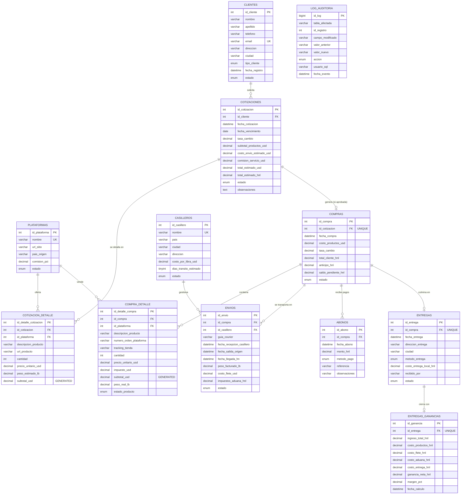

# TUCOMPRAS — Proyecto de Base de Datos MySQL

## Sistema de Gestión Integral para Empresa de Personal Shopper Internacional

| Campo | Detalle |
|---|---|
| **Empresa** | TUCOMPRAS — Personal Shopper Internacional |
| **Base de datos** | `tucompras_db` |
| **Motor** | MySQL 8.x — InnoDB, `utf8mb4_unicode_ci` |
| **Herramienta de modelado** | MySQL Workbench |
| **Alcance geográfico** | Compras en EE. UU., China y otros mercados; casilleros en Miami y México (expansión: Panamá); distribución en Honduras |
| **Fecha** | 17 de mayo de 2026 |
| **Estado del script** | ✅ Validado por ejecución completa en servidor MySQL/MariaDB (DDL, SP, vistas y triggers probados con ciclo de negocio real) |

---

# FASE 1. Levantamiento de Requerimientos (Análisis del Negocio)

## 1.1 Contexto de la empresa

TUCOMPRAS es una empresa hondureña de *Personal Shopper Internacional*: compra por encargo productos en plataformas extranjeras (Amazon, SheIn, Temu, New Balance, eBay, entre otras), los recibe en casilleros internacionales (actualmente Miami y México, con expansión prevista a nuevos países), los importa a Honduras y los entrega al cliente final. Su propuesta de valor combina asesoría personalizada, transparencia de costos, seguimiento permanente del pedido y entrega confiable. Atiende cuatro segmentos definidos en su arquitectura de marca: **Personal** (clientes individuales), **Business** (emprendedores y empresas que compran para reventa), **Express** (compras con tiempos reducidos) y **Global**.

## 1.2 Flujo de operaciones (proceso de negocio de punta a punta)

El ciclo de vida de un pedido atraviesa **ocho etapas** que el sistema debe registrar y controlar:

**Etapa 1 — Solicitud del cliente.**
El cliente (nuevo o recurrente) contacta a TUCOMPRAS por sus canales digitales e indica los productos que desea: enlaces (URL), descripción, cantidad, tallas o variantes. Si es un cliente nuevo, se capturan sus datos personales (nombre, teléfono, correo, dirección, ciudad) y se clasifica según el segmento de servicio. *Requerimiento de datos:* registro único de clientes, sin duplicados por telefono o correo, con estado Activo/Inactivo.

**Etapa 2 — Cotización.**
El equipo de operaciones arma una cotización formal: por cada producto se registra la plataforma de origen, el precio unitario en dólares (USD), la cantidad y el peso estimado en libras. El sistema calcula dinámicamente: subtotal de productos, costo estimado de envío internacional (peso estimado × tarifa por libra del casillero previsto), comisión de servicio de TUCOMPRAS (porcentaje configurado por plataforma) y el total estimado en USD y en Lempiras (HNL) usando la tasa de cambio vigente, que queda "fotografiada" en la cotización para trazabilidad histórica. La cotización tiene vigencia (fecha de vencimiento) y estados: *Pendiente → Enviada → Aprobada / Rechazada / Vencida*.

**Etapa 3 — Aprobación y anticipo.**
Si el cliente aprueba, normalmente entrega un **anticipo** (usualmente 50%). El sistema debe calcular automáticamente el **saldo pendiente** = total pactado − anticipo, y mantener el estado de cuenta actualizado con cada abono posterior.

**Etapa 4 — Ejecución de la compra.**
TUCOMPRAS ejecuta la compra en cada plataforma. Se registra el costo real pagado (que puede diferir del cotizado por ofertas o impuestos de la tienda), el número de orden de cada plataforma y el tracking de la tienda hacia el casillero. Una cotización aprobada genera **exactamente una compra**, pero una compra puede involucrar productos de **varias plataformas**.

**Etapa 5 — Recepción en casillero internacional.**
Los paquetes llegan al casillero (Miami o México según la plataforma y la ruta óptima). Allí se consolidan cuando aplica, se pesa la carga real y se genera el envío internacional con su guía de courier. Una compra puede dividirse en **varios envíos**, y cada envío pasa por **un** casillero. Datos clave: fecha de recepción, peso facturado, costo de flete (USD) y estado logístico.

**Etapa 6 — Tránsito internacional y aduana.**
El envío viaja a Honduras. Se registran la fecha de salida, la fecha de llegada y los **impuestos de aduana** pagados en HNL, que impactan directamente la rentabilidad del pedido. Estados: *En_Casillero → En_Transito → En_Aduana → Recibido_HN*.

**Etapa 7 — Entrega al cliente en Honduras.**
Con la mercadería en Honduras, se programa la entrega (a domicilio, punto de entrega u oficina). **Regla de negocio crítica:** no se entrega con saldo pendiente; si el cliente paga contra entrega, se registra el abono de liquidación en ese momento. Se guarda fecha, dirección, ciudad, costo de la entrega local y quién recibió.

**Etapa 8 — Cierre financiero (ganancias/pérdidas).**
Al entregar, el sistema genera el desglose financiero del pedido:

```text
Ingreso total (lo que pagó el cliente, HNL)
  − Costo real de productos (USD × tasa de cambio)
  − Costo de flete internacional (USD × tasa)
  − Impuestos de aduana (HNL)
  − Costo de entrega local (HNL)
  = GANANCIA (o PÉRDIDA) NETA + margen %
```

Este cierre alimenta los reportes gerenciales de rentabilidad por pedido, por cliente, por plataforma y por producto.

## 1.3 Requerimientos funcionales derivados

| # | Requerimiento | Módulo |
|---|---|---|
| RF-01 | Registrar clientes únicos con validación de telefono/correo y segmentación por tipo | Clientes |
| RF-02 | Mantener catálogo de plataformas con su % de comisión de servicio | Catálogos |
| RF-03 | Mantener catálogo de casilleros con tarifa por libra y días de tránsito, ampliable a nuevos países | Catálogos |
| RF-04 | Crear cotizaciones multiproducto y multiplataforma con cálculo automático de subtotales, envío, comisión y totales USD/HNL | Cotizaciones |
| RF-05 | Controlar estados y vigencia de cotizaciones | Cotizaciones |
| RF-06 | Registrar la compra a partir de una cotización aprobada, copiando su detalle y calculando el saldo (total − anticipo) | Compras |
| RF-07 | Registrar abonos y actualizar automáticamente el estado de cuenta (trigger) | Finanzas |
| RF-08 | Rastrear envíos por casillero: pesos, fletes, aduana y estados logísticos | Logística |
| RF-09 | Registrar entregas en Honduras bloqueando entregas con saldo pendiente | Entregas |
| RF-10 | Calcular y almacenar el desglose de ganancia/pérdida por pedido entregado | Finanzas |
| RF-11 | Auditar todo cambio crítico de precios y comisiones en bitácora histórica | Auditoría |
| RF-12 | Reportes gerenciales: historial de cotizaciones, cuentas por cobrar y rentabilidad | Reportes |
| RF-13 | Seguridad por roles: administrador total y operaciones limitado | Seguridad |
| RF-14 | Respaldo y restauración de la base de datos | Administración |

## 1.4 Reglas de negocio (RN)

1. **RN-01:** Un cliente inactivo no puede recibir cotizaciones.
2. **RN-02:** Solo cotizaciones en estado *Aprobada* generan compra, y solo **una** compra.
3. **RN-03:** El anticipo nunca supera el total pactado; un abono nunca supera el saldo pendiente.
4. **RN-04:** El saldo pendiente se actualiza **exclusivamente** mediante abonos registrados (única fuente de verdad financiera).
5. **RN-05:** No existe entrega con saldo mayor que cero.
6. **RN-06:** La tasa de cambio se congela por documento (cotización y compra) para exactitud histórica.
7. **RN-07:** Ningún registro maestro con movimientos puede eliminarse (integridad `ON DELETE RESTRICT`).
8. **RN-08:** Todo cambio de comisión o tarifa queda en `log_auditoria` con usuario y fecha.

---

# FASE 2. Modelo Conceptual

En el nivel conceptual se identifican las entidades de alto nivel del negocio, sin detalles de implementación. Se reconocen **12 entidades**, agrupadas en cuatro dominios.

## 2.1 Dominio de actores y catálogos

| Entidad | Razón de ser en el negocio |
|---|---|
| **CLIENTES** | Núcleo comercial: toda cotización, compra y entrega existe porque un cliente la solicitó. Permite historial, segmentación (Personal/Business/Express/Global) y cuentas por cobrar por persona. |
| **PLATAFORMAS** | Catálogo de tiendas internacionales (Amazon, SheIn, Temu, New Balance…). Centraliza el % de comisión de servicio que TUCOMPRAS aplica por tienda y habilita reportes de rentabilidad por plataforma. |
| **CASILLEROS** | Direcciones logísticas internacionales (Miami, México y futuras). Cada casillero define su tarifa por libra y días de tránsito; la entidad hace escalable la expansión sin tocar la estructura. |

## 2.2 Dominio comercial (preventa)

| Entidad | Razón de ser en el negocio |
|---|---|
| **COTIZACIONES** | Documento formal de propuesta económica previo a la compra. Fija la tasa de cambio, los totales estimados y el estado de negociación. Es el contrato preliminar con el cliente. |
| **COTIZACION_DETALLE** | Cada producto cotizado, con su plataforma, precio, cantidad y peso estimado. Resuelve la relación N:M entre cotizaciones y plataformas y permite cotizar en varias tiendas dentro de un mismo documento. |

## 2.3 Dominio de ejecución y logística

| Entidad | Razón de ser en el negocio |
|---|---|
| **COMPRAS** | La ejecución real de una cotización aprobada: costo real pagado a las tiendas, total pactado con el cliente, anticipo y saldo. Es el eje del estado de cuenta y del estado logístico global del pedido. |
| **COMPRA_DETALLE** | Productos efectivamente comprados con número de orden y tracking por tienda. Resuelve la relación N:M compras↔plataformas y permite seguimiento de cada artículo. |
| **ENVIOS** | Traslado físico casillero→Honduras: guía, pesos facturados, flete, aduana y fechas. Resuelve la relación N:M compras↔casilleros (una compra puede llegar en varios envíos; cada envío pasa por un casillero). |

## 2.4 Dominio financiero y de control

| Entidad | Razón de ser en el negocio |
|---|---|
| **ABONOS** | Cada pago del cliente (anticipo, abonos parciales, liquidación). Es la única fuente que mueve el saldo pendiente, lo que garantiza un estado de cuenta auditable. |
| **ENTREGAS** | La entrega física final en Honduras: dónde, cuándo, cómo y quién recibió. Cierra el ciclo logístico del pedido. |
| **ENTREGAS_GANANCIAS** | Cierre financiero por pedido entregado: ingreso, desglose de costos (productos, flete, aduana, entrega) y ganancia/pérdida neta con margen. Materializa el requerimiento gerencial de rentabilidad. |
| **LOG_AUDITORIA** | Bitácora histórica e inmutable de cambios críticos (precios, comisiones, tarifas), alimentada por triggers. Soporta control interno y trazabilidad. |

## 2.5 Diagrama conceptual de alto nivel

```text
CLIENTES ──solicitan──▶ COTIZACIONES ──se detallan en──▶ COTIZACION_DETALLE ◀──ofertan── PLATAFORMAS
                              │                                                              ▲
                        (aprobada 1:1)                                                       │
                              ▼                                                              │
                          COMPRAS ──se detallan en──▶ COMPRA_DETALLE ────────────────────────┘
                          │  │  │
             ┌────────────┘  │  └───────────────┐
             ▼               ▼                  ▼
          ABONOS          ENVIOS ◀──gestionan── CASILLEROS
        (pagos del        (flete y aduana)
         cliente)            
                              
          COMPRAS ──culminan en (1:1)──▶ ENTREGAS ──generan (1:1)──▶ ENTREGAS_GANANCIAS
          
          PLATAFORMAS / CASILLEROS / COMPRA_DETALLE ──auditados por──▶ LOG_AUDITORIA
```

---

# FASE 3. Modelo Lógico

El modelo lógico traduce cada entidad conceptual a una estructura de atributos, identificando **llaves primarias (PK)**, **llaves foráneas (FK)** y las **cardinalidades** formales de cada relación de negocio.

## 3.1 Entidades con atributos y llaves

**CLIENTES** (`id_cliente` **PK**)
> nombre, apellido, telefono *(único)*, email *(único)*, direccion, ciudad, tipo_cliente, fecha_registro, estado

**PLATAFORMAS** (`id_plataforma` **PK**)
> nombre *(único)*, url_sitio, pais_origen, comision_pct, estado

**CASILLEROS** (`id_casillero` **PK**)
> nombre *(único)*, pais, ciudad, direccion, costo_por_libra_usd, dias_transito_estimado, estado

**COTIZACIONES** (`id_cotizacion` **PK**; `id_cliente` **FK → CLIENTES**)
> fecha_cotizacion, fecha_vencimiento, tasa_cambio, subtotal_productos_usd, costo_envio_estimado_usd, comision_servicio_usd, total_estimado_usd, total_estimado_hnl, estado, observaciones

**COTIZACION_DETALLE** (`id_detalle_cotizacion` **PK**; `id_cotizacion` **FK → COTIZACIONES**; `id_plataforma` **FK → PLATAFORMAS**)
> descripcion_producto, url_producto, cantidad, precio_unitario_usd, peso_estimado_lb, subtotal_usd *(calculado)*

**COMPRAS** (`id_compra` **PK**; `id_cotizacion` **FK → COTIZACIONES**, *única* para forzar el 1:1)
> fecha_compra, costo_productos_usd, tasa_cambio, total_cliente_hnl, anticipo_hnl, saldo_pendiente_hnl, estado

**COMPRA_DETALLE** (`id_detalle_compra` **PK**; `id_compra` **FK → COMPRAS**; `id_plataforma` **FK → PLATAFORMAS**)
> descripcion_producto, numero_orden_plataforma, tracking_tienda, cantidad, precio_unitario_usd, impuesto_usd, subtotal_usd *(calculado)*, peso_real_lb, estado_producto

**ENVIOS** (`id_envio` **PK**; `id_compra` **FK → COMPRAS**; `id_casillero` **FK → CASILLEROS**)
> guia_courier, fecha_recepcion_casillero, fecha_salida_origen, fecha_llegada_hn, peso_facturado_lb, costo_flete_usd, impuestos_aduana_hnl, estado

**ABONOS** (`id_abono` **PK**; `id_compra` **FK → COMPRAS**)
> fecha_abono, monto_hnl, metodo_pago, referencia, observaciones

**ENTREGAS** (`id_entrega` **PK**; `id_compra` **FK → COMPRAS**, *única* para forzar el 1:1)
> fecha_entrega, direccion_entrega, ciudad, metodo_entrega, costo_entrega_local_hnl, recibido_por, estado

**ENTREGAS_GANANCIAS** (`id_ganancia` **PK**; `id_entrega` **FK → ENTREGAS**, *única* para forzar el 1:1)
> ingreso_total_hnl, costo_productos_hnl, costo_flete_hnl, costo_aduana_hnl, costo_entrega_hnl, ganancia_neta_hnl, margen_pct, fecha_calculo

**LOG_AUDITORIA** (`id_log` **PK** — sin FK deliberadamente: la bitácora debe sobrevivir a cualquier cambio y auditar varias tablas)
> tabla_afectada, id_registro, campo_modificado, valor_anterior, valor_nuevo, accion, usuario_sql, fecha_evento

## 3.2 Relaciones de negocio y cardinalidades

| # | Relación | Cardinalidad | Lectura de negocio |
|---|---|---|---|
| R1 | CLIENTES — COTIZACIONES | **1:N** | Un cliente solicita muchas cotizaciones; cada cotización pertenece a un solo cliente. |
| R2 | COTIZACIONES — PLATAFORMAS | **N:M** → resuelta con COTIZACION_DETALLE | Una cotización incluye productos de varias plataformas; una plataforma aparece en muchas cotizaciones. |
| R3 | COTIZACIONES — COMPRAS | **1:1** (FK única) | Una cotización aprobada genera exactamente una compra. |
| R4 | COMPRAS — PLATAFORMAS | **N:M** → resuelta con COMPRA_DETALLE | Una compra abarca varias tiendas; una tienda participa en muchas compras. |
| R5 | COMPRAS — CASILLEROS | **N:M** → resuelta con ENVIOS | Una compra puede llegar en varios envíos por distintos casilleros; un casillero gestiona envíos de muchas compras. |
| R6 | COMPRAS — ABONOS | **1:N** | Una compra recibe muchos pagos (anticipo + abonos + liquidación). |
| R7 | COMPRAS — ENTREGAS | **1:1** (FK única) | Cada compra culmina en una única entrega final. |
| R8 | ENTREGAS — ENTREGAS_GANANCIAS | **1:1** (FK única) | Cada entrega produce exactamente un cierre financiero. |

> **Nota de diseño:** COMPRAS **no** almacena `id_cliente`; el cliente se obtiene navegando `COMPRAS → COTIZACIONES → CLIENTES`. Duplicar el FK introduciría una dependencia transitiva (violación de 3FN) y riesgo de inconsistencia (una compra apuntando a un cliente distinto al de su cotización).

---

# FASE 4. Normalización

## 4.1 Primera Forma Normal (1FN) — atomicidad y ausencia de grupos repetitivos

**Regla:** cada celda contiene un único valor atómico; no hay columnas repetidas ni listas dentro de un campo; toda tabla tiene PK.

**Ejemplo práctico — antes de 1FN** (hoja de cálculo típica del negocio):

| cotizacion | cliente | productos | plataformas | precios |
|---|---|---|---|---|
| C-001 | María Rodríguez, 9988-7766, Col. Kennedy | Audífonos Sony; Organizador x2 | Amazon; Temu | 299.99; 15.50 |

Problemas: `cliente` mezcla nombre+teléfono+dirección (no atómico); `productos`, `plataformas` y `precios` son **listas** (grupos repetitivos) imposibles de filtrar, sumar o indexar.

**Después de 1FN:** los datos del cliente se separan en columnas atómicas (`nombre`, `apellido`, `telefono`, `direccion`) dentro de CLIENTES, y cada producto pasa a ser **una fila** de COTIZACION_DETALLE:

| id_detalle (PK) | id_cotizacion | id_plataforma | descripcion_producto | cantidad | precio_unitario_usd |
|---|---|---|---|---|---|
| 1 | 1 | 1 (Amazon) | Audífonos Sony WH-1000XM5 | 1 | 299.99 |
| 2 | 1 | 3 (Temu) | Organizador de escritorio | 2 | 15.50 |

## 4.2 Segunda Forma Normal (2FN) — dependencia completa de la PK

**Regla:** estando en 1FN, ningún atributo no clave depende de *parte* de una clave compuesta.

**Ejemplo práctico:** si COTIZACION_DETALLE usara la clave compuesta `(id_cotizacion, id_plataforma)` y almacenara `nombre_plataforma` y `comision_pct`, esos atributos dependerían **solo** de `id_plataforma` (dependencia parcial): el nombre "Amazon" se repetiría en miles de filas y un cambio de comisión exigiría actualizar todas.

**Aplicación:** los atributos de la plataforma viven únicamente en PLATAFORMAS; el detalle guarda solo el FK `id_plataforma`. Además se adoptan **PK sustitutas simples** (`id_detalle_cotizacion` AUTO_INCREMENT), con lo cual toda dependencia parcial queda estructuralmente eliminada: cada atributo del detalle (cantidad, precio, peso) depende de la fila completa del producto cotizado.

## 4.3 Tercera Forma Normal (3FN) — sin dependencias transitivas

**Regla:** estando en 2FN, ningún atributo no clave depende de otro atributo no clave.

**Ejemplo práctico 1:** guardar en ENVIOS el `pais_casillero` y la `tarifa_por_libra` sería una dependencia transitiva: `id_envio → id_casillero → pais, tarifa`. Si Miami cambia su tarifa, habría que corregir históricamente miles de envíos. **Solución:** esos atributos residen solo en CASILLEROS y el envío guarda su **costo de flete real facturado** (`costo_flete_usd`), que sí es un hecho propio del envío.

**Ejemplo práctico 2:** almacenar `nombre_cliente` o `telefono` en COMPRAS dependería transitivamente de `id_cotizacion → id_cliente → nombre`. Se elimina navegando por FK.

**Excepción justificada (no es violación):** `tasa_cambio` aparece en COTIZACIONES y en COMPRAS porque es una **fotografía histórica del hecho transaccional** — la tasa del día en que se pactó — no un atributo derivable de otra tabla. Igualmente `total_estimado_*` y `subtotal_usd` son **columnas calculadas controladas** (por procedimiento almacenado o `GENERATED ALWAYS`), decisión estándar de desnormalización controlada para rendimiento de reportes, sin riesgo de inconsistencia porque el SGBD o los SP son los únicos que las escriben.

## 4.4 Ruptura de relaciones N:M con tablas puente

| Relación N:M original | Tabla puente | FKs que la componen | Atributos propios de la relación |
|---|---|---|---|
| COTIZACIONES ↔ PLATAFORMAS | **COTIZACION_DETALLE** | id_cotizacion, id_plataforma | producto, cantidad, precio, peso estimado |
| COMPRAS ↔ PLATAFORMAS | **COMPRA_DETALLE** | id_compra, id_plataforma | orden, tracking, precio real, impuesto, estado |
| COMPRAS ↔ CASILLEROS | **ENVIOS** | id_compra, id_casillero | guía, fechas, peso, flete, aduana, estado |

Cada tabla puente posee PK propia, FKs con `ON DELETE RESTRICT ON UPDATE CASCADE` y atributos que pertenecen *a la relación* (no a ninguna de las dos entidades por separado), garantizando integridad referencial total.

---

# FASE 5. Diagrama ERD (Entity-Relationship Diagram)

## 5.1 Diagrama en Mermaid.js



## 5.2 Cómo plasmarlo en MySQL Workbench (líneas identificables vs. no identificables)

En MySQL Workbench (Model → *Add Diagram*, notación **Crow's Foot / IE**), las relaciones se dibujan así:

- **Línea continua (relación identificable / *identifying*):** se usa cuando la FK **forma parte de la PK** de la tabla hija — la hija no existe sin la madre a nivel de telefono. En este modelo, al usar PK sustitutas (`AUTO_INCREMENT`) en todas las tablas, no hay FKs dentro de las PK; sin embargo, si el docente/estándar del proyecto exige mostrar dependencia existencial, las tablas puente (`cotizacion_detalle`, `compra_detalle`, `envios`) y los cierres 1:1 (`entregas`, `entregas_ganancias`) pueden modelarse como identificables (línea continua), pues carecen de sentido sin su cabecera.
- **Línea discontinua (relación no identificable / *non-identifying*):** la FK es un atributo normal, no parte de la PK. Es el caso formal de **todas** las relaciones de este diseño tal como está el DDL: `clientes→cotizaciones`, `cotizaciones→compras`, `plataformas→detalles`, `casilleros→envios`, `compras→abonos/entregas`, `entregas→entregas_ganancias`.

Guía de conexión en Workbench, relación por relación (herramienta **1:n Non-Identifying** salvo indicación):

| Conectar de (PK) | Hacia (FK) | Herramienta Workbench | Cardinalidad visible |
|---|---|---|---|
| clientes | cotizaciones | 1:n discontinua | 1 ──< N |
| cotizaciones | cotizacion_detalle | 1:n (continua si se desea identificable) | 1 ──< N |
| plataformas | cotizacion_detalle | 1:n discontinua | 1 ──< N |
| cotizaciones | compras | **1:1** discontinua (FK con índice UNIQUE) | 1 ── 1 |
| compras | compra_detalle | 1:n (continua opcional) | 1 ──< N |
| plataformas | compra_detalle | 1:n discontinua | 1 ──< N |
| compras | envios | 1:n (continua opcional) | 1 ──< N |
| casilleros | envios | 1:n discontinua | 1 ──< N |
| compras | abonos | 1:n discontinua | 1 ──< N |
| compras | entregas | **1:1** discontinua (FK UNIQUE) | 1 ── 1 |
| entregas | entregas_ganancias | **1:1** discontinua (FK UNIQUE) | 1 ── 1 |
| log_auditoria | — | sin conexión (auditoría desacoplada) | — |

> **Tip Workbench:** para que Workbench dibuje 1:1, basta con que la columna FK tenga índice `UNIQUE` (ya definido en el DDL con `uq_compras_cotizacion`, `uq_entregas_compra`, `uq_ganancias_entrega`); al usar *Database → Reverse Engineer* sobre el script de la Fase 7, el diagrama se genera automáticamente con estas cardinalidades correctas.

---

# FASE 6. Modelo Físico

## 6.1 Decisiones físicas globales

| Decisión | Valor | Justificación |
|---|---|---|
| Motor de almacenamiento | **InnoDB** | Transacciones ACID, llaves foráneas reales, bloqueo por fila |
| Juego de caracteres | **utf8mb4 / utf8mb4_unicode_ci** | Soporte total de español, símbolos y emojis en descripciones |
| Moneda / dinero | **DECIMAL(12,2) / DECIMAL(14,2)** | Exactitud aritmética; jamás FLOAT para dinero |
| Tasa de cambio | **DECIMAL(8,4)** | 4 decimales de precisión cambiaria (ej. 26.5041) |
| Estados de proceso | **ENUM** | Dominio cerrado, validado por el motor, 1 byte de almacenamiento |
| Identificadores | **INT UNSIGNED AUTO_INCREMENT** (BIGINT en bitácora) | Rango amplio, sin negativos |
| Subtotales de detalle | **GENERATED ALWAYS ... STORED** | El motor calcula `cantidad × precio`; imposible de desincronizar |
| Borrado | **ON DELETE RESTRICT** | Prohíbe perder historial comercial |
| Actualización de PK | **ON UPDATE CASCADE** | Propagación segura ante renumeraciones |

## 6.2 Estructura física por tabla

### 6.2.1 `clientes`

| Columna | Tipo MySQL | Restricciones |
|---|---|---|
| id_cliente | INT UNSIGNED | PK, NOT NULL, AUTO_INCREMENT |
| nombre | VARCHAR(60) | NOT NULL |
| apellido | VARCHAR(60) | NOT NULL | | VARCHAR(20) | NOT NULL, UNIQUE |
| telefono | VARCHAR(20) | NOT NULL |
| email | VARCHAR(120) | NULL, UNIQUE |
| direccion | VARCHAR(255) | NULL |
| ciudad | VARCHAR(80) | NULL, DEFAULT 'Tegucigalpa' |
| tipo_cliente | ENUM('Personal','Business','Express','Global') | NOT NULL, DEFAULT 'Personal' |
| fecha_registro | DATETIME | NOT NULL, DEFAULT CURRENT_TIMESTAMP |
| estado | ENUM('Activo','Inactivo') | NOT NULL, DEFAULT 'Activo' |

**Índices:** `idx_clientes_nombre (apellido, nombre)`, `idx_clientes_telefono`, `idx_clientes_estado` — optimizan la búsqueda frecuente de clientes por nombre, teléfono y estado.

### 6.2.2 `plataformas`

| Columna | Tipo MySQL | Restricciones |
|---|---|---|
| id_plataforma | INT UNSIGNED | PK, NOT NULL, AUTO_INCREMENT |
| nombre | VARCHAR(80) | NOT NULL, UNIQUE |
| url_sitio | VARCHAR(150) | NULL |
| pais_origen | VARCHAR(60) | NOT NULL, DEFAULT 'Estados Unidos' |
| comision_pct | DECIMAL(5,2) | NOT NULL, DEFAULT 10.00, CHECK 0–100 |
| estado | ENUM('Activa','Inactiva') | NOT NULL, DEFAULT 'Activa' |

### 6.2.3 `casilleros`

| Columna | Tipo MySQL | Restricciones |
|---|---|---|
| id_casillero | INT UNSIGNED | PK, NOT NULL, AUTO_INCREMENT |
| nombre | VARCHAR(80) | NOT NULL, UNIQUE |
| pais | VARCHAR(60) | NOT NULL |
| ciudad | VARCHAR(80) | NOT NULL |
| direccion | VARCHAR(255) | NOT NULL |
| costo_por_libra_usd | DECIMAL(8,2) | NOT NULL, CHECK ≥ 0 |
| dias_transito_estimado | TINYINT UNSIGNED | NOT NULL, DEFAULT 7 |
| estado | ENUM('Activo','Inactivo','En_Apertura') | NOT NULL, DEFAULT 'Activo' |

**Índices:** `idx_casilleros_pais`, `idx_casilleros_estado`.

### 6.2.4 `cotizaciones`

| Columna | Tipo MySQL | Restricciones |
|---|---|---|
| id_cotizacion | INT UNSIGNED | PK, NOT NULL, AUTO_INCREMENT |
| id_cliente | INT UNSIGNED | NOT NULL, FK → clientes |
| fecha_cotizacion | DATETIME | NOT NULL, DEFAULT CURRENT_TIMESTAMP |
| fecha_vencimiento | DATE | NULL |
| tasa_cambio | DECIMAL(8,4) | NOT NULL, CHECK > 0 |
| subtotal_productos_usd | DECIMAL(12,2) | NOT NULL, DEFAULT 0.00 |
| costo_envio_estimado_usd | DECIMAL(10,2) | NOT NULL, DEFAULT 0.00 |
| comision_servicio_usd | DECIMAL(10,2) | NOT NULL, DEFAULT 0.00 |
| total_estimado_usd | DECIMAL(12,2) | NOT NULL, DEFAULT 0.00 |
| total_estimado_hnl | DECIMAL(14,2) | NOT NULL, DEFAULT 0.00 |
| estado | ENUM('Pendiente','Enviada','Aprobada','Rechazada','Vencida') | NOT NULL, DEFAULT 'Pendiente' |
| observaciones | TEXT | NULL |

**Índices:** `idx_cotizaciones_cliente_estado (id_cliente, estado)` — índice compuesto para la consulta más frecuente del negocio ("cotizaciones de este cliente por estado") — y `idx_cotizaciones_fecha`.

### 6.2.5 `cotizacion_detalle`

| Columna | Tipo MySQL | Restricciones |
|---|---|---|
| id_detalle_cotizacion | INT UNSIGNED | PK, NOT NULL, AUTO_INCREMENT |
| id_cotizacion | INT UNSIGNED | NOT NULL, FK → cotizaciones |
| id_plataforma | INT UNSIGNED | NOT NULL, FK → plataformas |
| descripcion_producto | VARCHAR(255) | NOT NULL |
| url_producto | VARCHAR(500) | NULL |
| cantidad | INT UNSIGNED | NOT NULL, DEFAULT 1, CHECK > 0 |
| precio_unitario_usd | DECIMAL(10,2) | NOT NULL, CHECK ≥ 0 |
| peso_estimado_lb | DECIMAL(8,2) | NOT NULL, DEFAULT 0.00 |
| subtotal_usd | DECIMAL(12,2) | GENERATED ALWAYS AS (cantidad × precio_unitario_usd) STORED |

**Índices:** `idx_cotdet_cotizacion`, `idx_cotdet_plataforma`.

### 6.2.6 `compras`

| Columna | Tipo MySQL | Restricciones |
|---|---|---|
| id_compra | INT UNSIGNED | PK, NOT NULL, AUTO_INCREMENT |
| id_cotizacion | INT UNSIGNED | NOT NULL, FK → cotizaciones, **UNIQUE** (fuerza 1:1) |
| fecha_compra | DATETIME | NOT NULL, DEFAULT CURRENT_TIMESTAMP |
| costo_productos_usd | DECIMAL(12,2) | NOT NULL, CHECK ≥ 0 |
| tasa_cambio | DECIMAL(8,4) | NOT NULL |
| total_cliente_hnl | DECIMAL(14,2) | NOT NULL, CHECK ≥ 0 |
| anticipo_hnl | DECIMAL(14,2) | NOT NULL, DEFAULT 0.00, CHECK ≥ 0 |
| saldo_pendiente_hnl | DECIMAL(14,2) | NOT NULL, DEFAULT 0.00 |
| estado | ENUM('Comprada','En_Casillero','En_Transito','En_Aduana','Recibida_HN','Entregada','Cancelada') | NOT NULL, DEFAULT 'Comprada' |

**Índices:** `idx_compras_estado`, `idx_compras_fecha`, `idx_compras_saldo` — este último acelera el reporte de cuentas por cobrar (`WHERE saldo_pendiente_hnl > 0`).

### 6.2.7 `compra_detalle`

| Columna | Tipo MySQL | Restricciones |
|---|---|---|
| id_detalle_compra | INT UNSIGNED | PK, NOT NULL, AUTO_INCREMENT |
| id_compra | INT UNSIGNED | NOT NULL, FK → compras |
| id_plataforma | INT UNSIGNED | NOT NULL, FK → plataformas |
| descripcion_producto | VARCHAR(255) | NOT NULL |
| numero_orden_plataforma | VARCHAR(80) | NULL |
| tracking_tienda | VARCHAR(100) | NULL |
| cantidad | INT UNSIGNED | NOT NULL, DEFAULT 1, CHECK > 0 |
| precio_unitario_usd | DECIMAL(10,2) | NOT NULL |
| impuesto_usd | DECIMAL(10,2) | NOT NULL, DEFAULT 0.00 |
| subtotal_usd | DECIMAL(12,2) | GENERATED ALWAYS AS ((cantidad × precio) + impuesto) STORED |
| peso_real_lb | DECIMAL(8,2) | NULL |
| estado_producto | ENUM('Ordenado','Recibido_Casillero','En_Transito','Recibido_HN','Entregado','Devuelto') | NOT NULL, DEFAULT 'Ordenado' |

**Índices:** `idx_compdet_compra`, `idx_compdet_plataforma`, `idx_compdet_estado`, `idx_compdet_tracking`.

### 6.2.8 `envios`

| Columna | Tipo MySQL | Restricciones |
|---|---|---|
| id_envio | INT UNSIGNED | PK, NOT NULL, AUTO_INCREMENT |
| id_compra | INT UNSIGNED | NOT NULL, FK → compras |
| id_casillero | INT UNSIGNED | NOT NULL, FK → casilleros |
| guia_courier | VARCHAR(100) | NULL |
| fecha_recepcion_casillero | DATETIME | NULL |
| fecha_salida_origen | DATETIME | NULL |
| fecha_llegada_hn | DATETIME | NULL |
| peso_facturado_lb | DECIMAL(8,2) | NOT NULL, DEFAULT 0.00 |
| costo_flete_usd | DECIMAL(10,2) | NOT NULL, DEFAULT 0.00 |
| impuestos_aduana_hnl | DECIMAL(12,2) | NOT NULL, DEFAULT 0.00 |
| estado | ENUM('En_Casillero','En_Transito','En_Aduana','Recibido_HN') | NOT NULL, DEFAULT 'En_Casillero' |

**Índices:** `idx_envios_compra`, `idx_envios_casillero`, `idx_envios_estado`, `idx_envios_guia`.

### 6.2.9 `abonos`

| Columna | Tipo MySQL | Restricciones |
|---|---|---|
| id_abono | INT UNSIGNED | PK, NOT NULL, AUTO_INCREMENT |
| id_compra | INT UNSIGNED | NOT NULL, FK → compras |
| fecha_abono | DATETIME | NOT NULL, DEFAULT CURRENT_TIMESTAMP |
| monto_hnl | DECIMAL(12,2) | NOT NULL, CHECK > 0 |
| metodo_pago | ENUM('Efectivo','Transferencia','Tarjeta','Deposito','Billetera_Digital') | NOT NULL, DEFAULT 'Efectivo' |
| referencia | VARCHAR(100) | NULL |
| observaciones | VARCHAR(255) | NULL |

**Índices:** `idx_abonos_compra`, `idx_abonos_fecha`.

### 6.2.10 `entregas`

| Columna | Tipo MySQL | Restricciones |
|---|---|---|
| id_entrega | INT UNSIGNED | PK, NOT NULL, AUTO_INCREMENT |
| id_compra | INT UNSIGNED | NOT NULL, FK → compras, **UNIQUE** (fuerza 1:1) |
| fecha_entrega | DATETIME | NULL |
| direccion_entrega | VARCHAR(255) | NOT NULL |
| ciudad | VARCHAR(80) | NOT NULL, DEFAULT 'Tegucigalpa' |
| metodo_entrega | ENUM('Domicilio','Punto_Entrega','Oficina') | NOT NULL, DEFAULT 'Domicilio' |
| costo_entrega_local_hnl | DECIMAL(10,2) | NOT NULL, DEFAULT 0.00 |
| recibido_por | VARCHAR(120) | NULL |
| estado | ENUM('Programada','En_Ruta','Entregada','Fallida') | NOT NULL, DEFAULT 'Programada' |

**Índices:** `idx_entregas_estado`, `idx_entregas_fecha`, `idx_entregas_ciudad`.

### 6.2.11 `entregas_ganancias`

| Columna | Tipo MySQL | Restricciones |
|---|---|---|
| id_ganancia | INT UNSIGNED | PK, NOT NULL, AUTO_INCREMENT |
| id_entrega | INT UNSIGNED | NOT NULL, FK → entregas, **UNIQUE** (fuerza 1:1) |
| ingreso_total_hnl | DECIMAL(14,2) | NOT NULL, DEFAULT 0.00 |
| costo_productos_hnl | DECIMAL(14,2) | NOT NULL, DEFAULT 0.00 |
| costo_flete_hnl | DECIMAL(12,2) | NOT NULL, DEFAULT 0.00 |
| costo_aduana_hnl | DECIMAL(12,2) | NOT NULL, DEFAULT 0.00 |
| costo_entrega_hnl | DECIMAL(10,2) | NOT NULL, DEFAULT 0.00 |
| ganancia_neta_hnl | DECIMAL(14,2) | NOT NULL, DEFAULT 0.00 |
| margen_pct | DECIMAL(6,2) | NOT NULL, DEFAULT 0.00 |
| fecha_calculo | DATETIME | NOT NULL, DEFAULT CURRENT_TIMESTAMP |

**Índices:** `idx_ganancias_fecha`.

### 6.2.12 `log_auditoria`

| Columna | Tipo MySQL | Restricciones |
|---|---|---|
| id_log | BIGINT UNSIGNED | PK, NOT NULL, AUTO_INCREMENT |
| tabla_afectada | VARCHAR(64) | NOT NULL |
| id_registro | INT UNSIGNED | NOT NULL |
| campo_modificado | VARCHAR(64) | NOT NULL |
| valor_anterior | VARCHAR(255) | NULL |
| valor_nuevo | VARCHAR(255) | NULL |
| accion | ENUM('INSERT','UPDATE','DELETE') | NOT NULL, DEFAULT 'UPDATE' |
| usuario_sql | VARCHAR(100) | NOT NULL |
| fecha_evento | DATETIME | NOT NULL, DEFAULT CURRENT_TIMESTAMP |

**Índices:** `idx_log_tabla (tabla_afectada, id_registro)`, `idx_log_fecha`.

---

# FASE 7. Scripts SQL (DDL)

El script completo está ordenado jerárquicamente para que **ninguna** `FOREIGN KEY` haga referencia a una tabla aún inexistente:

```text
Nivel 0 (maestras, sin FK):  clientes → plataformas → casilleros
Nivel 1:                     cotizaciones (FK clientes)
Nivel 2:                     cotizacion_detalle (FK cotizaciones, plataformas)
                             compras (FK cotizaciones)
Nivel 3:                     compra_detalle (FK compras, plataformas)
                             envios (FK compras, casilleros)
                             abonos (FK compras)
                             entregas (FK compras)
Nivel 4:                     entregas_ganancias (FK entregas)
Independiente:               log_auditoria (sin FK, por diseño)
```

Todas las FK usan `ON DELETE RESTRICT ON UPDATE CASCADE`. El script fue **ejecutado y verificado** de inicio a fin sin errores.

```sql
-- ----------------------------------------------------------------------------
-- FASE 7.1 : CREACIÓN DE LA BASE DE DATOS
-- ----------------------------------------------------------------------------
DROP DATABASE IF EXISTS tucompras_db;

CREATE DATABASE tucompras_db
    CHARACTER SET utf8mb4
    COLLATE utf8mb4_unicode_ci;

USE tucompras_db;

-- ----------------------------------------------------------------------------
-- FASE 7.2 : TABLAS MAESTRAS (sin dependencias de llaves foráneas)
-- ----------------------------------------------------------------------------

-- ============================================================
-- Tabla: clientes
-- Personas o empresas que solicitan compras internacionales.
-- ============================================================
CREATE TABLE clientes (
    id_cliente       INT UNSIGNED     NOT NULL AUTO_INCREMENT,
    nombre           VARCHAR(60)      NOT NULL,
    apellido         VARCHAR(60)      NOT NULL,
    telefono         VARCHAR(20)      NOT NULL,
    email            VARCHAR(120)     NULL,
    direccion        VARCHAR(255)     NULL,
    ciudad           VARCHAR(80)      NULL     DEFAULT 'Tegucigalpa',
    tipo_cliente     ENUM('Personal','Business','Express','Global')
                                      NOT NULL DEFAULT 'Personal',
    fecha_registro   DATETIME         NOT NULL DEFAULT CURRENT_TIMESTAMP,
    estado           ENUM('Activo','Inactivo')
                                      NOT NULL DEFAULT 'Activo',
    CONSTRAINT pk_clientes            PRIMARY KEY (id_cliente),
    CONSTRAINT uq_clientes_email      UNIQUE (email),
    INDEX idx_clientes_nombre         (apellido, nombre),
    INDEX idx_clientes_telefono       (telefono),
    INDEX idx_clientes_estado         (estado)
) ENGINE = InnoDB;

-- ============================================================
-- Tabla: plataformas
-- Tiendas internacionales donde se ejecutan las compras
-- (Amazon, SheIn, Temu, New Balance, etc.).
-- ============================================================
CREATE TABLE plataformas (
    id_plataforma    INT UNSIGNED     NOT NULL AUTO_INCREMENT,
    nombre           VARCHAR(80)      NOT NULL,
    url_sitio        VARCHAR(150)     NULL,
    pais_origen      VARCHAR(60)      NOT NULL DEFAULT 'Estados Unidos',
    comision_pct     DECIMAL(5,2)     NOT NULL DEFAULT 10.00
                     COMMENT 'Porcentaje de comisión de servicio que TUCOMPRAS cobra por compras en esta plataforma',
    estado           ENUM('Activa','Inactiva')
                                      NOT NULL DEFAULT 'Activa',
    CONSTRAINT pk_plataformas         PRIMARY KEY (id_plataforma),
    CONSTRAINT uq_plataformas_nombre  UNIQUE (nombre),
    CONSTRAINT chk_plataformas_comision CHECK (comision_pct >= 0 AND comision_pct <= 100)
) ENGINE = InnoDB;

-- ============================================================
-- Tabla: casilleros
-- Direcciones físicas internacionales (Miami, México, futuras
-- expansiones) donde se reciben los paquetes antes de viajar
-- a Honduras.
-- ============================================================
CREATE TABLE casilleros (
    id_casillero             INT UNSIGNED     NOT NULL AUTO_INCREMENT,
    nombre                   VARCHAR(80)      NOT NULL,
    pais                     VARCHAR(60)      NOT NULL,
    ciudad                   VARCHAR(80)      NOT NULL,
    direccion                VARCHAR(255)     NOT NULL,
    costo_por_libra_usd      DECIMAL(8,2)     NOT NULL,
    dias_transito_estimado   TINYINT UNSIGNED NOT NULL DEFAULT 7,
    estado                   ENUM('Activo','Inactivo','En_Apertura')
                                              NOT NULL DEFAULT 'Activo',
    CONSTRAINT pk_casilleros            PRIMARY KEY (id_casillero),
    CONSTRAINT uq_casilleros_nombre     UNIQUE (nombre),
    CONSTRAINT chk_casilleros_costo     CHECK (costo_por_libra_usd >= 0),
    INDEX idx_casilleros_pais           (pais),
    INDEX idx_casilleros_estado         (estado)
) ENGINE = InnoDB;

-- ----------------------------------------------------------------------------
-- FASE 7.3 : TABLAS TRANSACCIONALES DE PRIMER NIVEL
-- ----------------------------------------------------------------------------

-- ============================================================
-- Tabla: cotizaciones
-- Cabecera de la propuesta económica enviada al cliente antes
-- de ejecutar la compra. Los totales se recalculan al agregar
-- líneas de detalle.
-- ============================================================
CREATE TABLE cotizaciones (
    id_cotizacion            INT UNSIGNED     NOT NULL AUTO_INCREMENT,
    id_cliente               INT UNSIGNED     NOT NULL,
    fecha_cotizacion         DATETIME         NOT NULL DEFAULT CURRENT_TIMESTAMP,
    fecha_vencimiento        DATE             NULL,
    tasa_cambio              DECIMAL(8,4)     NOT NULL
                             COMMENT 'Tasa USD -> HNL vigente al momento de cotizar (fotografía histórica)',
    subtotal_productos_usd   DECIMAL(12,2)    NOT NULL DEFAULT 0.00,
    costo_envio_estimado_usd DECIMAL(10,2)    NOT NULL DEFAULT 0.00,
    comision_servicio_usd    DECIMAL(10,2)    NOT NULL DEFAULT 0.00,
    total_estimado_usd       DECIMAL(12,2)    NOT NULL DEFAULT 0.00,
    total_estimado_hnl       DECIMAL(14,2)    NOT NULL DEFAULT 0.00,
    estado                   ENUM('Pendiente','Enviada','Aprobada','Rechazada','Vencida')
                                              NOT NULL DEFAULT 'Pendiente',
    observaciones            TEXT             NULL,
    CONSTRAINT pk_cotizaciones          PRIMARY KEY (id_cotizacion),
    CONSTRAINT fk_cotizaciones_clientes FOREIGN KEY (id_cliente)
        REFERENCES clientes (id_cliente)
        ON DELETE RESTRICT ON UPDATE CASCADE,
    CONSTRAINT chk_cotizaciones_tasa    CHECK (tasa_cambio > 0),
    INDEX idx_cotizaciones_cliente_estado (id_cliente, estado),
    INDEX idx_cotizaciones_fecha          (fecha_cotizacion)
) ENGINE = InnoDB;

-- ============================================================
-- Tabla: cotizacion_detalle  (tabla puente Cotizaciones <-> Plataformas)
-- Rompe la relación N:M entre cotizaciones y plataformas.
-- Cada fila = un producto cotizado en una plataforma.
-- ============================================================
CREATE TABLE cotizacion_detalle (
    id_detalle_cotizacion    INT UNSIGNED     NOT NULL AUTO_INCREMENT,
    id_cotizacion            INT UNSIGNED     NOT NULL,
    id_plataforma            INT UNSIGNED     NOT NULL,
    descripcion_producto     VARCHAR(255)     NOT NULL,
    url_producto             VARCHAR(500)     NULL,
    cantidad                 INT UNSIGNED     NOT NULL DEFAULT 1,
    precio_unitario_usd      DECIMAL(10,2)    NOT NULL,
    peso_estimado_lb         DECIMAL(8,2)     NOT NULL DEFAULT 0.00,
    subtotal_usd             DECIMAL(12,2)
                             GENERATED ALWAYS AS (cantidad * precio_unitario_usd) STORED,
    CONSTRAINT pk_cotizacion_detalle    PRIMARY KEY (id_detalle_cotizacion),
    CONSTRAINT fk_cotdet_cotizaciones   FOREIGN KEY (id_cotizacion)
        REFERENCES cotizaciones (id_cotizacion)
        ON DELETE RESTRICT ON UPDATE CASCADE,
    CONSTRAINT fk_cotdet_plataformas    FOREIGN KEY (id_plataforma)
        REFERENCES plataformas (id_plataforma)
        ON DELETE RESTRICT ON UPDATE CASCADE,
    CONSTRAINT chk_cotdet_cantidad      CHECK (cantidad > 0),
    CONSTRAINT chk_cotdet_precio        CHECK (precio_unitario_usd >= 0),
    INDEX idx_cotdet_cotizacion         (id_cotizacion),
    INDEX idx_cotdet_plataforma         (id_plataforma)
) ENGINE = InnoDB;

-- ============================================================
-- Tabla: compras
-- Compra real ejecutada tras la aprobación de una cotización.
-- Relación 1:1 con cotizaciones (una cotización aprobada
-- genera una única compra).
-- ============================================================
CREATE TABLE compras (
    id_compra                INT UNSIGNED     NOT NULL AUTO_INCREMENT,
    id_cotizacion            INT UNSIGNED     NOT NULL,
    fecha_compra             DATETIME         NOT NULL DEFAULT CURRENT_TIMESTAMP,
    costo_productos_usd      DECIMAL(12,2)    NOT NULL
                             COMMENT 'Costo real pagado por TUCOMPRAS a las plataformas',
    tasa_cambio              DECIMAL(8,4)     NOT NULL,
    total_cliente_hnl        DECIMAL(14,2)    NOT NULL
                             COMMENT 'Precio total pactado con el cliente en Lempiras',
    anticipo_hnl             DECIMAL(14,2)    NOT NULL DEFAULT 0.00,
    saldo_pendiente_hnl      DECIMAL(14,2)    NOT NULL DEFAULT 0.00,
    estado                   ENUM('Comprada','En_Casillero','En_Transito','En_Aduana',
                                  'Recibida_HN','Entregada','Cancelada')
                                              NOT NULL DEFAULT 'Comprada',
    CONSTRAINT pk_compras               PRIMARY KEY (id_compra),
    CONSTRAINT uq_compras_cotizacion    UNIQUE (id_cotizacion),
    CONSTRAINT fk_compras_cotizaciones  FOREIGN KEY (id_cotizacion)
        REFERENCES cotizaciones (id_cotizacion)
        ON DELETE RESTRICT ON UPDATE CASCADE,
    CONSTRAINT chk_compras_montos       CHECK (costo_productos_usd >= 0
                                           AND total_cliente_hnl  >= 0
                                           AND anticipo_hnl       >= 0),
    INDEX idx_compras_estado            (estado),
    INDEX idx_compras_fecha             (fecha_compra),
    INDEX idx_compras_saldo             (saldo_pendiente_hnl)
) ENGINE = InnoDB;

-- ============================================================
-- Tabla: compra_detalle  (tabla puente Compras <-> Plataformas)
-- Productos realmente comprados, con número de orden y
-- tracking de la tienda. Rompe la relación N:M entre compras
-- y plataformas.
-- ============================================================
CREATE TABLE compra_detalle (
    id_detalle_compra        INT UNSIGNED     NOT NULL AUTO_INCREMENT,
    id_compra                INT UNSIGNED     NOT NULL,
    id_plataforma            INT UNSIGNED     NOT NULL,
    descripcion_producto     VARCHAR(255)     NOT NULL,
    numero_orden_plataforma  VARCHAR(80)      NULL,
    tracking_tienda          VARCHAR(100)     NULL,
    cantidad                 INT UNSIGNED     NOT NULL DEFAULT 1,
    precio_unitario_usd      DECIMAL(10,2)    NOT NULL,
    impuesto_usd             DECIMAL(10,2)    NOT NULL DEFAULT 0.00,
    subtotal_usd             DECIMAL(12,2)
                             GENERATED ALWAYS AS ((cantidad * precio_unitario_usd) + impuesto_usd) STORED,
    peso_real_lb             DECIMAL(8,2)     NULL,
    estado_producto          ENUM('Ordenado','Recibido_Casillero','En_Transito',
                                  'Recibido_HN','Entregado','Devuelto')
                                              NOT NULL DEFAULT 'Ordenado',
    CONSTRAINT pk_compra_detalle        PRIMARY KEY (id_detalle_compra),
    CONSTRAINT fk_compdet_compras       FOREIGN KEY (id_compra)
        REFERENCES compras (id_compra)
        ON DELETE RESTRICT ON UPDATE CASCADE,
    CONSTRAINT fk_compdet_plataformas   FOREIGN KEY (id_plataforma)
        REFERENCES plataformas (id_plataforma)
        ON DELETE RESTRICT ON UPDATE CASCADE,
    CONSTRAINT chk_compdet_cantidad     CHECK (cantidad > 0),
    INDEX idx_compdet_compra            (id_compra),
    INDEX idx_compdet_plataforma        (id_plataforma),
    INDEX idx_compdet_estado            (estado_producto),
    INDEX idx_compdet_tracking          (tracking_tienda)
) ENGINE = InnoDB;

-- ----------------------------------------------------------------------------
-- FASE 7.4 : TABLAS LOGÍSTICAS Y FINANCIERAS
-- ----------------------------------------------------------------------------

-- ============================================================
-- Tabla: envios  (tabla puente Compras <-> Casilleros)
-- Cada compra puede llegar a Honduras en uno o varios envíos,
-- y cada envío pasa por exactamente un casillero. Rompe la
-- relación N:M entre compras y casilleros.
-- ============================================================
CREATE TABLE envios (
    id_envio                 INT UNSIGNED     NOT NULL AUTO_INCREMENT,
    id_compra                INT UNSIGNED     NOT NULL,
    id_casillero             INT UNSIGNED     NOT NULL,
    guia_courier             VARCHAR(100)     NULL,
    fecha_recepcion_casillero DATETIME        NULL,
    fecha_salida_origen      DATETIME         NULL,
    fecha_llegada_hn         DATETIME         NULL,
    peso_facturado_lb        DECIMAL(8,2)     NOT NULL DEFAULT 0.00,
    costo_flete_usd          DECIMAL(10,2)    NOT NULL DEFAULT 0.00,
    impuestos_aduana_hnl     DECIMAL(12,2)    NOT NULL DEFAULT 0.00,
    estado                   ENUM('En_Casillero','En_Transito','En_Aduana','Recibido_HN')
                                              NOT NULL DEFAULT 'En_Casillero',
    CONSTRAINT pk_envios                PRIMARY KEY (id_envio),
    CONSTRAINT fk_envios_compras        FOREIGN KEY (id_compra)
        REFERENCES compras (id_compra)
        ON DELETE RESTRICT ON UPDATE CASCADE,
    CONSTRAINT fk_envios_casilleros     FOREIGN KEY (id_casillero)
        REFERENCES casilleros (id_casillero)
        ON DELETE RESTRICT ON UPDATE CASCADE,
    INDEX idx_envios_compra             (id_compra),
    INDEX idx_envios_casillero          (id_casillero),
    INDEX idx_envios_estado             (estado),
    INDEX idx_envios_guia               (guia_courier)
) ENGINE = InnoDB;

-- ============================================================
-- Tabla: abonos
-- Pagos parciales o totales realizados por el cliente sobre
-- una compra. El trigger trg_abonos_ai_actualizar_saldo
-- descuenta automáticamente el saldo pendiente.
-- ============================================================
CREATE TABLE abonos (
    id_abono                 INT UNSIGNED     NOT NULL AUTO_INCREMENT,
    id_compra                INT UNSIGNED     NOT NULL,
    fecha_abono              DATETIME         NOT NULL DEFAULT CURRENT_TIMESTAMP,
    monto_hnl                DECIMAL(12,2)    NOT NULL,
    metodo_pago              ENUM('Efectivo','Transferencia','Tarjeta','Deposito','Billetera_Digital')
                                              NOT NULL DEFAULT 'Efectivo',
    referencia               VARCHAR(100)     NULL,
    observaciones            VARCHAR(255)     NULL,
    CONSTRAINT pk_abonos                PRIMARY KEY (id_abono),
    CONSTRAINT fk_abonos_compras        FOREIGN KEY (id_compra)
        REFERENCES compras (id_compra)
        ON DELETE RESTRICT ON UPDATE CASCADE,
    CONSTRAINT chk_abonos_monto         CHECK (monto_hnl > 0),
    INDEX idx_abonos_compra             (id_compra),
    INDEX idx_abonos_fecha              (fecha_abono)
) ENGINE = InnoDB;

-- ============================================================
-- Tabla: entregas
-- Entrega final del pedido al cliente en Honduras.
-- Relación 1:1 con compras.
-- ============================================================
CREATE TABLE entregas (
    id_entrega               INT UNSIGNED     NOT NULL AUTO_INCREMENT,
    id_compra                INT UNSIGNED     NOT NULL,
    fecha_entrega            DATETIME         NULL,
    direccion_entrega        VARCHAR(255)     NOT NULL,
    ciudad                   VARCHAR(80)      NOT NULL DEFAULT 'Tegucigalpa',
    metodo_entrega           ENUM('Domicilio','Punto_Entrega','Oficina')
                                              NOT NULL DEFAULT 'Domicilio',
    costo_entrega_local_hnl  DECIMAL(10,2)    NOT NULL DEFAULT 0.00,
    recibido_por             VARCHAR(120)     NULL,
    estado                   ENUM('Programada','En_Ruta','Entregada','Fallida')
                                              NOT NULL DEFAULT 'Programada',
    CONSTRAINT pk_entregas              PRIMARY KEY (id_entrega),
    CONSTRAINT uq_entregas_compra       UNIQUE (id_compra),
    CONSTRAINT fk_entregas_compras      FOREIGN KEY (id_compra)
        REFERENCES compras (id_compra)
        ON DELETE RESTRICT ON UPDATE CASCADE,
    INDEX idx_entregas_estado           (estado),
    INDEX idx_entregas_fecha            (fecha_entrega),
    INDEX idx_entregas_ciudad           (ciudad)
) ENGINE = InnoDB;

-- ============================================================
-- Tabla: entregas_ganancias
-- Cierre financiero de cada pedido entregado: ingresos,
-- desglose de costos y ganancia/pérdida neta.
-- Relación 1:1 con entregas. Poblada por sp_procesar_entrega.
-- ============================================================
CREATE TABLE entregas_ganancias (
    id_ganancia              INT UNSIGNED     NOT NULL AUTO_INCREMENT,
    id_entrega               INT UNSIGNED     NOT NULL,
    ingreso_total_hnl        DECIMAL(14,2)    NOT NULL DEFAULT 0.00,
    costo_productos_hnl      DECIMAL(14,2)    NOT NULL DEFAULT 0.00,
    costo_flete_hnl          DECIMAL(12,2)    NOT NULL DEFAULT 0.00,
    costo_aduana_hnl         DECIMAL(12,2)    NOT NULL DEFAULT 0.00,
    costo_entrega_hnl        DECIMAL(10,2)    NOT NULL DEFAULT 0.00,
    ganancia_neta_hnl        DECIMAL(14,2)    NOT NULL DEFAULT 0.00,
    margen_pct               DECIMAL(6,2)     NOT NULL DEFAULT 0.00,
    fecha_calculo            DATETIME         NOT NULL DEFAULT CURRENT_TIMESTAMP,
    CONSTRAINT pk_entregas_ganancias    PRIMARY KEY (id_ganancia),
    CONSTRAINT uq_ganancias_entrega     UNIQUE (id_entrega),
    CONSTRAINT fk_ganancias_entregas    FOREIGN KEY (id_entrega)
        REFERENCES entregas (id_entrega)
        ON DELETE RESTRICT ON UPDATE CASCADE,
    INDEX idx_ganancias_fecha           (fecha_calculo)
) ENGINE = InnoDB;

-- ============================================================
-- Tabla: log_auditoria
-- Bitácora histórica de cambios críticos (precios y comisiones)
-- alimentada exclusivamente por triggers de auditoría.
-- ============================================================
CREATE TABLE log_auditoria (
    id_log                   BIGINT UNSIGNED  NOT NULL AUTO_INCREMENT,
    tabla_afectada           VARCHAR(64)      NOT NULL,
    id_registro              INT UNSIGNED     NOT NULL,
    campo_modificado         VARCHAR(64)      NOT NULL,
    valor_anterior           VARCHAR(255)     NULL,
    valor_nuevo              VARCHAR(255)     NULL,
    accion                   ENUM('INSERT','UPDATE','DELETE')
                                              NOT NULL DEFAULT 'UPDATE',
    usuario_sql              VARCHAR(100)     NOT NULL,
    fecha_evento             DATETIME         NOT NULL DEFAULT CURRENT_TIMESTAMP,
    CONSTRAINT pk_log_auditoria         PRIMARY KEY (id_log),
    INDEX idx_log_tabla                 (tabla_afectada, id_registro),
    INDEX idx_log_fecha                 (fecha_evento)
) ENGINE = InnoDB;
```

---

# FASE 8. Procedimientos Almacenados (Stored Procedures)

Cuatro procedimientos principales más un procedimiento de apoyo (`sp_agregar_detalle_cotizacion`) que materializa el cálculo dinámico de subtotales exigido en la cotización. Todos validan reglas de negocio con `SIGNAL SQLSTATE '45000'` y devuelven el ID generado mediante parámetro `OUT`.

| Procedimiento | Reglas que aplica |
|---|---|
| `sp_registrar_cliente` | Obligatoriedad de nombre/apellido/teléfono, formato de email, anti-duplicados por telefono y correo |
| `sp_crear_cotizacion` | Cliente existente y Activo, tasa de cambio > 0, vigencia por defecto de 5 días |
| `sp_agregar_detalle_cotizacion` | Cotización editable, plataforma activa; recalcula subtotal, envío estimado (peso × tarifa), comisión ponderada por plataforma y totales USD/HNL |
| `sp_registrar_compra` | Cotización Aprobada y sin compra previa (1:1), anticipo ≤ total; copia el detalle cotizado y registra el anticipo como primer abono — el **trigger** deja el saldo en `total − anticipo` automáticamente |
| `sp_procesar_entrega` | Compra Recibida_HN y no entregada; permite liquidar el saldo contra entrega; **bloquea la entrega con saldo > 0**; cierra compra y productos; calcula y guarda el desglose de ganancias/pérdidas |

```sql
-- ============================================================================
-- FASE 8 : PROCEDIMIENTOS ALMACENADOS (STORED PROCEDURES)
-- ============================================================================

DELIMITER $$

-- ----------------------------------------------------------------------------
-- 8.1  sp_registrar_cliente
--      Inserta un cliente nuevo validando datos obligatorios y duplicados.
-- ----------------------------------------------------------------------------
CREATE PROCEDURE sp_registrar_cliente (
    IN  p_nombre        VARCHAR(60),
    IN  p_apellido      VARCHAR(60),
    IN  p_telefono      VARCHAR(20),
    IN  p_email         VARCHAR(120),
    IN  p_direccion     VARCHAR(255),
    IN  p_ciudad        VARCHAR(80),
    IN  p_tipo_cliente  VARCHAR(20),
    OUT p_id_cliente    INT
)
BEGIN
    -- Validación 1: campos obligatorios no vacíos
    IF p_nombre IS NULL OR TRIM(p_nombre) = '' THEN
        SIGNAL SQLSTATE '45000'
            SET MESSAGE_TEXT = 'ERROR: El nombre del cliente es obligatorio.';
    END IF;

    IF p_apellido IS NULL OR TRIM(p_apellido) = '' THEN
        SIGNAL SQLSTATE '45000'
            SET MESSAGE_TEXT = 'ERROR: El apellido del cliente es obligatorio.';
    END IF;

    IF p_telefono IS NULL OR TRIM(p_telefono) = '' THEN
        SIGNAL SQLSTATE '45000'
            SET MESSAGE_TEXT = 'ERROR: El teléfono del cliente es obligatorio.';
    END IF;

    -- Validación 2: formato mínimo de email (si se proporciona)
    IF p_email IS NOT NULL AND p_email NOT LIKE '%_@_%._%' THEN
        SIGNAL SQLSTATE '45000'
            SET MESSAGE_TEXT = 'ERROR: El formato del correo electrónico no es válido.';
    END IF;

    -- Validación 3: duplicados por telefono
    IF EXISTS (SELECT 1 FROM clientes WHERE telefono = p_telefono) THEN
        SIGNAL SQLSTATE '45000'
            SET MESSAGE_TEXT = 'ERROR: Ya existe un cliente registrado con este telefono.';
    END IF;

    -- Validación 4: duplicados por email
    IF p_email IS NOT NULL
       AND EXISTS (SELECT 1 FROM clientes WHERE email = p_email) THEN
        SIGNAL SQLSTATE '45000'
            SET MESSAGE_TEXT = 'ERROR: Ya existe un cliente registrado con ese correo.';
    END IF;

    -- Inserción del cliente
    INSERT INTO clientes (nombre, apellido, telefono, email,
                          direccion, ciudad, tipo_cliente)
    VALUES (TRIM(p_nombre),
            TRIM(p_apellido),
            TRIM(p_telefono),
            p_email,
            p_direccion,
            IFNULL(p_ciudad, 'Tegucigalpa'),
            IFNULL(NULLIF(p_tipo_cliente, ''), 'Personal'));

    SET p_id_cliente = LAST_INSERT_ID();
END $$

-- ----------------------------------------------------------------------------
-- 8.2a sp_crear_cotizacion
--      Crea la cabecera de la cotización para un cliente activo.
-- ----------------------------------------------------------------------------
CREATE PROCEDURE sp_crear_cotizacion (
    IN  p_id_cliente     INT,
    IN  p_tasa_cambio    DECIMAL(8,4),
    IN  p_dias_vigencia  INT,
    IN  p_observaciones  TEXT,
    OUT p_id_cotizacion  INT
)
BEGIN
    DECLARE v_estado_cliente VARCHAR(10);

    -- Validación 1: existencia y estado del cliente
    SELECT estado INTO v_estado_cliente
    FROM clientes
    WHERE id_cliente = p_id_cliente;

    IF v_estado_cliente IS NULL THEN
        SIGNAL SQLSTATE '45000'
            SET MESSAGE_TEXT = 'ERROR: El cliente indicado no existe.';
    END IF;

    IF v_estado_cliente <> 'Activo' THEN
        SIGNAL SQLSTATE '45000'
            SET MESSAGE_TEXT = 'ERROR: El cliente está inactivo; no puede cotizar.';
    END IF;

    -- Validación 2: tasa de cambio positiva
    IF p_tasa_cambio IS NULL OR p_tasa_cambio <= 0 THEN
        SIGNAL SQLSTATE '45000'
            SET MESSAGE_TEXT = 'ERROR: La tasa de cambio debe ser mayor que cero.';
    END IF;

    -- Inserción de la cabecera (los totales inician en 0 y se
    -- recalculan al agregar detalle con sp_agregar_detalle_cotizacion)
    INSERT INTO cotizaciones (id_cliente, tasa_cambio, fecha_vencimiento, observaciones)
    VALUES (p_id_cliente,
            p_tasa_cambio,
            DATE_ADD(CURDATE(), INTERVAL IFNULL(p_dias_vigencia, 5) DAY),
            p_observaciones);

    SET p_id_cotizacion = LAST_INSERT_ID();
END $$

-- ----------------------------------------------------------------------------
-- 8.2b sp_agregar_detalle_cotizacion
--      Agrega un producto a la cotización y RECALCULA DINÁMICAMENTE los
--      subtotales, comisión de servicio, envío estimado y totales USD/HNL.
-- ----------------------------------------------------------------------------
CREATE PROCEDURE sp_agregar_detalle_cotizacion (
    IN p_id_cotizacion        INT,
    IN p_id_plataforma        INT,
    IN p_descripcion          VARCHAR(255),
    IN p_url_producto         VARCHAR(500),
    IN p_cantidad             INT,
    IN p_precio_unitario_usd  DECIMAL(10,2),
    IN p_peso_estimado_lb     DECIMAL(8,2),
    IN p_costo_libra_usd      DECIMAL(8,2)   -- tarifa del casillero previsto
)
BEGIN
    DECLARE v_estado_cot       VARCHAR(15);
    DECLARE v_comision_pct     DECIMAL(5,2);
    DECLARE v_subtotal_usd     DECIMAL(12,2);
    DECLARE v_envio_usd        DECIMAL(10,2);
    DECLARE v_comision_usd     DECIMAL(10,2);
    DECLARE v_tasa             DECIMAL(8,4);

    -- Validación 1: la cotización debe existir y estar editable
    SELECT estado, tasa_cambio INTO v_estado_cot, v_tasa
    FROM cotizaciones
    WHERE id_cotizacion = p_id_cotizacion;

    IF v_estado_cot IS NULL THEN
        SIGNAL SQLSTATE '45000'
            SET MESSAGE_TEXT = 'ERROR: La cotización indicada no existe.';
    END IF;

    IF v_estado_cot NOT IN ('Pendiente', 'Enviada') THEN
        SIGNAL SQLSTATE '45000'
            SET MESSAGE_TEXT = 'ERROR: Solo se puede agregar detalle a cotizaciones Pendientes o Enviadas.';
    END IF;

    -- Validación 2: plataforma activa
    SELECT comision_pct INTO v_comision_pct
    FROM plataformas
    WHERE id_plataforma = p_id_plataforma
      AND estado = 'Activa';

    IF v_comision_pct IS NULL THEN
        SIGNAL SQLSTATE '45000'
            SET MESSAGE_TEXT = 'ERROR: La plataforma no existe o está inactiva.';
    END IF;

    -- Inserción de la línea de detalle
    INSERT INTO cotizacion_detalle (id_cotizacion, id_plataforma, descripcion_producto,
                                    url_producto, cantidad, precio_unitario_usd,
                                    peso_estimado_lb)
    VALUES (p_id_cotizacion, p_id_plataforma, p_descripcion, p_url_producto,
            IFNULL(p_cantidad, 1), p_precio_unitario_usd,
            IFNULL(p_peso_estimado_lb, 0));

    -- Recalculo dinámico de la cabecera:
    --   subtotal    = SUM(cantidad * precio)
    --   envío est.  = SUM(peso) * costo_por_libra
    --   comisión    = subtotal ponderado por la comisión de cada plataforma
    SELECT  IFNULL(SUM(cd.subtotal_usd), 0),
            IFNULL(SUM(cd.peso_estimado_lb), 0) * IFNULL(p_costo_libra_usd, 0),
            IFNULL(SUM(cd.subtotal_usd * pl.comision_pct / 100), 0)
    INTO    v_subtotal_usd, v_envio_usd, v_comision_usd
    FROM    cotizacion_detalle cd
    INNER JOIN plataformas pl ON pl.id_plataforma = cd.id_plataforma
    WHERE   cd.id_cotizacion = p_id_cotizacion;

    UPDATE cotizaciones
    SET subtotal_productos_usd   = v_subtotal_usd,
        costo_envio_estimado_usd = v_envio_usd,
        comision_servicio_usd    = v_comision_usd,
        total_estimado_usd       = v_subtotal_usd + v_envio_usd + v_comision_usd,
        total_estimado_hnl       = ROUND((v_subtotal_usd + v_envio_usd + v_comision_usd) * v_tasa, 2)
    WHERE id_cotizacion = p_id_cotizacion;
END $$

-- ----------------------------------------------------------------------------
-- 8.3  sp_registrar_compra
--      Registra la compra de una cotización APROBADA, copia el detalle,
--      calcula automáticamente el saldo pendiente (total - anticipo) y
--      registra el anticipo como primer abono.
-- ----------------------------------------------------------------------------
CREATE PROCEDURE sp_registrar_compra (
    IN  p_id_cotizacion       INT,
    IN  p_costo_productos_usd DECIMAL(12,2),
    IN  p_tasa_cambio         DECIMAL(8,4),
    IN  p_anticipo_hnl        DECIMAL(14,2),
    IN  p_metodo_pago         VARCHAR(20),
    OUT p_id_compra           INT
)
BEGIN
    DECLARE v_estado_cot   VARCHAR(15);
    DECLARE v_total_hnl    DECIMAL(14,2);

    -- Validación 1: la cotización debe existir y estar Aprobada
    SELECT estado, total_estimado_hnl INTO v_estado_cot, v_total_hnl
    FROM cotizaciones
    WHERE id_cotizacion = p_id_cotizacion;

    IF v_estado_cot IS NULL THEN
        SIGNAL SQLSTATE '45000'
            SET MESSAGE_TEXT = 'ERROR: La cotización indicada no existe.';
    END IF;

    IF v_estado_cot <> 'Aprobada' THEN
        SIGNAL SQLSTATE '45000'
            SET MESSAGE_TEXT = 'ERROR: Solo se pueden comprar cotizaciones en estado Aprobada.';
    END IF;

    -- Validación 2: una cotización solo genera una compra (relación 1:1)
    IF EXISTS (SELECT 1 FROM compras WHERE id_cotizacion = p_id_cotizacion) THEN
        SIGNAL SQLSTATE '45000'
            SET MESSAGE_TEXT = 'ERROR: Esta cotización ya tiene una compra registrada.';
    END IF;

    -- Validación 3: el anticipo no puede superar el total
    IF IFNULL(p_anticipo_hnl, 0) > v_total_hnl THEN
        SIGNAL SQLSTATE '45000'
            SET MESSAGE_TEXT = 'ERROR: El anticipo no puede ser mayor que el total de la compra.';
    END IF;

    -- Inserción de la compra.
    -- El saldo inicia igual al total; el trigger de abonos lo irá
    -- descontando (incluido el anticipo, que se registra como abono).
    INSERT INTO compras (id_cotizacion, costo_productos_usd, tasa_cambio,
                         total_cliente_hnl, anticipo_hnl, saldo_pendiente_hnl)
    VALUES (p_id_cotizacion,
            p_costo_productos_usd,
            p_tasa_cambio,
            v_total_hnl,
            IFNULL(p_anticipo_hnl, 0),
            v_total_hnl);            -- saldo inicial = total

    SET p_id_compra = LAST_INSERT_ID();

    -- Copia automática del detalle cotizado hacia el detalle de compra
    INSERT INTO compra_detalle (id_compra, id_plataforma, descripcion_producto,
                                cantidad, precio_unitario_usd)
    SELECT  p_id_compra,
            cd.id_plataforma,
            cd.descripcion_producto,
            cd.cantidad,
            cd.precio_unitario_usd
    FROM    cotizacion_detalle cd
    WHERE   cd.id_cotizacion = p_id_cotizacion;

    -- El anticipo se registra como primer abono:
    -- el trigger trg_abonos_ai_actualizar_saldo calculará
    -- automáticamente: saldo = total - anticipo.
    IF IFNULL(p_anticipo_hnl, 0) > 0 THEN
        INSERT INTO abonos (id_compra, monto_hnl, metodo_pago, observaciones)
        VALUES (p_id_compra,
                p_anticipo_hnl,
                IFNULL(NULLIF(p_metodo_pago, ''), 'Efectivo'),
                'Anticipo inicial de la compra');
    END IF;
END $$

-- ----------------------------------------------------------------------------
-- 8.4  sp_procesar_entrega
--      Registra la entrega en Honduras, exige la liquidación del saldo,
--      cierra la compra y calcula el desglose de ganancias/pérdidas.
-- ----------------------------------------------------------------------------
CREATE PROCEDURE sp_procesar_entrega (
    IN  p_id_compra              INT,
    IN  p_direccion_entrega      VARCHAR(255),
    IN  p_ciudad                 VARCHAR(80),
    IN  p_metodo_entrega         VARCHAR(20),
    IN  p_costo_entrega_hnl      DECIMAL(10,2),
    IN  p_recibido_por           VARCHAR(120),
    IN  p_monto_liquidacion_hnl  DECIMAL(12,2),  -- pago final del cliente (0 si ya pagó)
    IN  p_metodo_pago            VARCHAR(20),
    OUT p_id_entrega             INT
)
BEGIN
    DECLARE v_estado_compra   VARCHAR(15);
    DECLARE v_saldo           DECIMAL(14,2);
    DECLARE v_ingreso         DECIMAL(14,2);
    DECLARE v_costo_prod      DECIMAL(14,2);
    DECLARE v_costo_flete     DECIMAL(12,2);
    DECLARE v_costo_aduana    DECIMAL(12,2);
    DECLARE v_tasa            DECIMAL(8,4);
    DECLARE v_ganancia        DECIMAL(14,2);

    -- Validación 1: la compra debe existir y haber llegado a Honduras
    SELECT estado, saldo_pendiente_hnl, total_cliente_hnl,
           costo_productos_usd * tasa_cambio, tasa_cambio
    INTO   v_estado_compra, v_saldo, v_ingreso, v_costo_prod, v_tasa
    FROM   compras
    WHERE  id_compra = p_id_compra;

    IF v_estado_compra IS NULL THEN
        SIGNAL SQLSTATE '45000'
            SET MESSAGE_TEXT = 'ERROR: La compra indicada no existe.';
    END IF;

    IF v_estado_compra = 'Entregada' THEN
        SIGNAL SQLSTATE '45000'
            SET MESSAGE_TEXT = 'ERROR: Esta compra ya fue entregada.';
    END IF;

    IF v_estado_compra NOT IN ('Recibida_HN') THEN
        SIGNAL SQLSTATE '45000'
            SET MESSAGE_TEXT = 'ERROR: La compra aún no ha sido recibida en Honduras.';
    END IF;

    -- Liquidación del saldo: si el cliente paga al recibir,
    -- se registra el abono final (el trigger descuenta el saldo).
    IF IFNULL(p_monto_liquidacion_hnl, 0) > 0 THEN
        INSERT INTO abonos (id_compra, monto_hnl, metodo_pago, observaciones)
        VALUES (p_id_compra,
                p_monto_liquidacion_hnl,
                IFNULL(NULLIF(p_metodo_pago, ''), 'Efectivo'),
                'Liquidación de saldo contra entrega');
    END IF;

    -- Releer el saldo ya actualizado por el trigger
    SELECT saldo_pendiente_hnl INTO v_saldo
    FROM   compras
    WHERE  id_compra = p_id_compra;

    IF v_saldo > 0 THEN
        SIGNAL SQLSTATE '45000'
            SET MESSAGE_TEXT = 'ERROR: No se puede entregar con saldo pendiente. Registre la liquidación.';
    END IF;

    -- Registro de la entrega
    INSERT INTO entregas (id_compra, fecha_entrega, direccion_entrega, ciudad,
                          metodo_entrega, costo_entrega_local_hnl,
                          recibido_por, estado)
    VALUES (p_id_compra,
            NOW(),
            p_direccion_entrega,
            IFNULL(p_ciudad, 'Tegucigalpa'),
            IFNULL(NULLIF(p_metodo_entrega, ''), 'Domicilio'),
            IFNULL(p_costo_entrega_hnl, 0),
            p_recibido_por,
            'Entregada');

    SET p_id_entrega = LAST_INSERT_ID();

    -- Cierre logístico de la compra y sus productos
    UPDATE compras
    SET    estado = 'Entregada'
    WHERE  id_compra = p_id_compra;

    UPDATE compra_detalle
    SET    estado_producto = 'Entregado'
    WHERE  id_compra = p_id_compra;

    -- Costos logísticos reales acumulados de todos los envíos de la compra
    SELECT IFNULL(SUM(e.costo_flete_usd * v_tasa), 0),
           IFNULL(SUM(e.impuestos_aduana_hnl), 0)
    INTO   v_costo_flete, v_costo_aduana
    FROM   envios e
    WHERE  e.id_compra = p_id_compra;

    -- Desglose financiero: ganancia = ingresos - todos los costos
    SET v_ganancia = v_ingreso - v_costo_prod - v_costo_flete
                     - v_costo_aduana - IFNULL(p_costo_entrega_hnl, 0);

    INSERT INTO entregas_ganancias (id_entrega, ingreso_total_hnl,
                                    costo_productos_hnl, costo_flete_hnl,
                                    costo_aduana_hnl, costo_entrega_hnl,
                                    ganancia_neta_hnl, margen_pct)
    VALUES (p_id_entrega,
            v_ingreso,
            v_costo_prod,
            v_costo_flete,
            v_costo_aduana,
            IFNULL(p_costo_entrega_hnl, 0),
            v_ganancia,
            CASE WHEN v_ingreso > 0
                 THEN ROUND(v_ganancia / v_ingreso * 100, 2)
                 ELSE 0 END);
END $$

DELIMITER ;
```

**Ejemplos de invocación (probados):**

```sql
-- Registrar cliente
CALL sp_registrar_cliente('María', 'Rodríguez', '0801-1990-12345', '9988-7766',
                          'maria.r@gmail.com', 'Col. Kennedy, Bloque 5',
                          'Tegucigalpa', 'Personal', @id_cliente);

-- Crear cotización y agregar productos (los totales se recalculan solos)
CALL sp_crear_cotizacion(@id_cliente, 26.50, 5, 'Pedido julio', @id_cot);
CALL sp_agregar_detalle_cotizacion(@id_cot, 1, 'Audífonos Sony WH-1000XM5',
                                   'https://a.co/xyz', 1, 299.99, 2.5, 2.50);
CALL sp_agregar_detalle_cotizacion(@id_cot, 3, 'Organizador de escritorio',
                                   'https://temu.com/abc', 2, 15.50, 3.0, 2.50);

-- Aprobar y comprar con anticipo del 50 %
UPDATE cotizaciones SET estado = 'Aprobada' WHERE id_cotizacion = @id_cot;
CALL sp_registrar_compra(@id_cot, 320.00, 26.50, 5000.00, 'Transferencia', @id_compra);

-- Entregar liquidando el saldo contra entrega
CALL sp_procesar_entrega(@id_compra, 'Col. Kennedy, Bloque 5', 'Tegucigalpa',
                         'Domicilio', 150.00, 'María Rodríguez',
                         5029.19, 'Efectivo', @id_entrega);
```

---

# FASE 9. Vistas (Views) para Reportes Gerenciales

| Vista | Pregunta gerencial que responde |
|---|---|
| `vw_resumen_cotizaciones` | ¿Qué se ha cotizado, a quién, en qué plataformas, por cuánto y en qué estado está? |
| `vw_compras_pendientes_pago` | ¿Quién nos debe, cuánto, qué porcentaje del total y hace cuántos días? |
| `vw_reporte_ganancias_totales` | ¿Cuánto ganamos (o perdimos) por pedido y por producto entregado, con desglose completo de costos? |

```sql
-- ============================================================================
-- FASE 9 : VISTAS (VIEWS) PARA REPORTES GERENCIALES
-- ============================================================================

-- ----------------------------------------------------------------------------
-- 9.1  vw_resumen_cotizaciones
--      Historial de cotizaciones por cliente y plataformas involucradas.
-- ----------------------------------------------------------------------------
CREATE OR REPLACE VIEW vw_resumen_cotizaciones AS
SELECT
    co.id_cotizacion                                        AS numero_cotizacion,
    CONCAT(cl.nombre, ' ', cl.apellido)                     AS cliente,
    cl.telefono                                             AS telefono,
    cl.tipo_cliente                                         AS tipo_cliente,
    co.fecha_cotizacion                                     AS fecha,
    co.fecha_vencimiento                                    AS vence,
    GROUP_CONCAT(DISTINCT pl.nombre ORDER BY pl.nombre
                 SEPARATOR ', ')                            AS plataformas,
    COUNT(cd.id_detalle_cotizacion)                         AS productos_cotizados,
    IFNULL(SUM(cd.cantidad), 0)                             AS unidades_totales,
    co.subtotal_productos_usd                               AS subtotal_usd,
    co.costo_envio_estimado_usd                             AS envio_estimado_usd,
    co.comision_servicio_usd                                AS comision_usd,
    co.total_estimado_usd                                   AS total_usd,
    co.total_estimado_hnl                                   AS total_lempiras,
    co.estado                                               AS estado
FROM cotizaciones co
INNER JOIN clientes cl           ON cl.id_cliente     = co.id_cliente
LEFT  JOIN cotizacion_detalle cd ON cd.id_cotizacion  = co.id_cotizacion
LEFT  JOIN plataformas pl        ON pl.id_plataforma  = cd.id_plataforma
GROUP BY co.id_cotizacion, cliente, cl.telefono, cl.tipo_cliente,
         co.fecha_cotizacion, co.fecha_vencimiento,
         co.subtotal_productos_usd, co.costo_envio_estimado_usd,
         co.comision_servicio_usd, co.total_estimado_usd,
         co.total_estimado_hnl, co.estado;

-- ----------------------------------------------------------------------------
-- 9.2  vw_compras_pendientes_pago
--      Clientes con saldos pendientes y sus montos totales.
-- ----------------------------------------------------------------------------
CREATE OR REPLACE VIEW vw_compras_pendientes_pago AS
SELECT
    cm.id_compra                                            AS numero_compra,
    CONCAT(cl.nombre, ' ', cl.apellido)                     AS cliente,
    cl.telefono                                             AS telefono,
    cl.email                                                AS correo,
    cm.fecha_compra                                         AS fecha_compra,
    cm.estado                                               AS estado_logistico,
    cm.total_cliente_hnl                                    AS total_lempiras,
    IFNULL(SUM(ab.monto_hnl), 0)                            AS total_abonado_hnl,
    cm.saldo_pendiente_hnl                                  AS saldo_pendiente_hnl,
    ROUND(cm.saldo_pendiente_hnl / cm.total_cliente_hnl * 100, 2)
                                                            AS pct_pendiente,
    DATEDIFF(CURDATE(), cm.fecha_compra)                    AS dias_desde_compra
FROM compras cm
INNER JOIN cotizaciones co ON co.id_cotizacion = cm.id_cotizacion
INNER JOIN clientes cl     ON cl.id_cliente    = co.id_cliente
LEFT  JOIN abonos ab       ON ab.id_compra     = cm.id_compra
WHERE cm.saldo_pendiente_hnl > 0
  AND cm.estado <> 'Cancelada'
GROUP BY cm.id_compra, cliente, cl.telefono, cl.email,
         cm.fecha_compra, cm.estado, cm.total_cliente_hnl,
         cm.saldo_pendiente_hnl
ORDER BY cm.saldo_pendiente_hnl DESC;

-- ----------------------------------------------------------------------------
-- 9.3  vw_reporte_ganancias_totales
--      Reporte financiero: desglose de costos, ganancia/pérdida del envío
--      y ganancia neta prorrateada por producto entregado.
-- ----------------------------------------------------------------------------
CREATE OR REPLACE VIEW vw_reporte_ganancias_totales AS
SELECT
    eg.id_ganancia                                          AS id_cierre,
    en.fecha_entrega                                        AS fecha_entrega,
    cm.id_compra                                            AS numero_compra,
    CONCAT(cl.nombre, ' ', cl.apellido)                     AS cliente,
    pl.nombre                                               AS plataforma,
    cdet.descripcion_producto                               AS producto,
    cdet.cantidad                                           AS cantidad,
    cdet.subtotal_usd                                       AS costo_producto_usd,
    -- Prorrateo: peso financiero del producto dentro de su compra
    ROUND(cdet.subtotal_usd /
          NULLIF(tot.suma_detalle_usd, 0) * 100, 2)         AS participacion_pct,
    -- Cifras de la compra completa
    eg.ingreso_total_hnl                                    AS ingreso_compra_hnl,
    eg.costo_productos_hnl                                  AS costo_productos_hnl,
    eg.costo_flete_hnl                                      AS costo_flete_hnl,
    eg.costo_aduana_hnl                                     AS costo_aduana_hnl,
    eg.costo_entrega_hnl                                    AS costo_entrega_hnl,
    (eg.costo_flete_hnl + eg.costo_aduana_hnl
        + eg.costo_entrega_hnl)                             AS costo_logistico_total_hnl,
    eg.ganancia_neta_hnl                                    AS ganancia_neta_compra_hnl,
    -- Ganancia neta atribuida a este producto (prorrateo por costo)
    ROUND(eg.ganancia_neta_hnl * cdet.subtotal_usd /
          NULLIF(tot.suma_detalle_usd, 0), 2)               AS ganancia_neta_producto_hnl,
    eg.margen_pct                                           AS margen_pct,
    CASE WHEN eg.ganancia_neta_hnl >= 0
         THEN 'GANANCIA' ELSE 'PÉRDIDA' END                 AS resultado
FROM entregas_ganancias eg
INNER JOIN entregas en        ON en.id_entrega   = eg.id_entrega
INNER JOIN compras cm         ON cm.id_compra    = en.id_compra
INNER JOIN cotizaciones co    ON co.id_cotizacion = cm.id_cotizacion
INNER JOIN clientes cl        ON cl.id_cliente   = co.id_cliente
INNER JOIN compra_detalle cdet ON cdet.id_compra = cm.id_compra
INNER JOIN plataformas pl     ON pl.id_plataforma = cdet.id_plataforma
INNER JOIN (
        SELECT id_compra, SUM(subtotal_usd) AS suma_detalle_usd
        FROM compra_detalle
        GROUP BY id_compra
     ) tot ON tot.id_compra = cm.id_compra
ORDER BY en.fecha_entrega DESC, cm.id_compra, cdet.id_detalle_compra;
```

**Resultados reales de la ejecución de prueba:**

```text
vw_resumen_cotizaciones
  #1 | María Rodríguez | Amazon, Temu | $378.46 | L 10,029.19 | Aprobada

vw_reporte_ganancias_totales (prorrateo por producto)
  Audífonos Sony WH-1000XM5  | participación 90.63 % | ganancia L 693.30 | GANANCIA
  Organizador de escritorio  | participación  9.37 % | ganancia L  71.64 | GANANCIA
```

---

# FASE 10. Triggers (Disparadores)

| Trigger | Evento | Función |
|---|---|---|
| `trg_abonos_bi_validar` | BEFORE INSERT en `abonos` | Rechaza montos ≤ 0, compras inexistentes y abonos que excedan el saldo pendiente |
| `trg_abonos_ai_actualizar_saldo` | AFTER INSERT en `abonos` | **Actualiza automáticamente el estado de cuenta:** `saldo = saldo − monto del abono` |
| `trg_plataformas_au_auditoria` | AFTER UPDATE en `plataformas` | Registra en `log_auditoria` todo cambio de `comision_pct` |
| `trg_casilleros_au_auditoria` | AFTER UPDATE en `casilleros` | Registra todo cambio de `costo_por_libra_usd` |
| `trg_compra_detalle_au_auditoria` | AFTER UPDATE en `compra_detalle` | Registra todo cambio de `precio_unitario_usd` en productos ya comprados |

```sql
-- ============================================================================
-- FASE 10 : TRIGGERS (DISPARADORES)
-- ============================================================================

DELIMITER $$

-- ----------------------------------------------------------------------------
-- 10.1a trg_abonos_bi_validar
--       BEFORE INSERT en abonos: valida que el monto sea positivo y que
--       no supere el saldo pendiente de la compra.
-- ----------------------------------------------------------------------------
CREATE TRIGGER trg_abonos_bi_validar
BEFORE INSERT ON abonos
FOR EACH ROW
BEGIN
    DECLARE v_saldo DECIMAL(14,2);

    IF NEW.monto_hnl <= 0 THEN
        SIGNAL SQLSTATE '45000'
            SET MESSAGE_TEXT = 'ERROR: El monto del abono debe ser mayor que cero.';
    END IF;

    SELECT saldo_pendiente_hnl INTO v_saldo
    FROM compras
    WHERE id_compra = NEW.id_compra;

    IF v_saldo IS NULL THEN
        SIGNAL SQLSTATE '45000'
            SET MESSAGE_TEXT = 'ERROR: La compra indicada para el abono no existe.';
    END IF;

    IF NEW.monto_hnl > v_saldo THEN
        SIGNAL SQLSTATE '45000'
            SET MESSAGE_TEXT = 'ERROR: El abono excede el saldo pendiente de la compra.';
    END IF;
END $$

-- ----------------------------------------------------------------------------
-- 10.1b trg_abonos_ai_actualizar_saldo
--       AFTER INSERT en abonos: actualiza automáticamente el estado de
--       cuenta (saldo pendiente) de la compra.
-- ----------------------------------------------------------------------------
CREATE TRIGGER trg_abonos_ai_actualizar_saldo
AFTER INSERT ON abonos
FOR EACH ROW
BEGIN
    UPDATE compras
    SET saldo_pendiente_hnl = saldo_pendiente_hnl - NEW.monto_hnl
    WHERE id_compra = NEW.id_compra;
END $$

-- ----------------------------------------------------------------------------
-- 10.2a trg_plataformas_au_auditoria
--       Audita cambios en la comisión de servicio por plataforma.
-- ----------------------------------------------------------------------------
CREATE TRIGGER trg_plataformas_au_auditoria
AFTER UPDATE ON plataformas
FOR EACH ROW
BEGIN
    IF OLD.comision_pct <> NEW.comision_pct THEN
        INSERT INTO log_auditoria (tabla_afectada, id_registro, campo_modificado,
                                   valor_anterior, valor_nuevo, accion, usuario_sql)
        VALUES ('plataformas', NEW.id_plataforma, 'comision_pct',
                CAST(OLD.comision_pct AS CHAR),
                CAST(NEW.comision_pct AS CHAR),
                'UPDATE', CURRENT_USER());
    END IF;
END $$

-- ----------------------------------------------------------------------------
-- 10.2b trg_casilleros_au_auditoria
--       Audita cambios en la tarifa por libra de los casilleros.
-- ----------------------------------------------------------------------------
CREATE TRIGGER trg_casilleros_au_auditoria
AFTER UPDATE ON casilleros
FOR EACH ROW
BEGIN
    IF OLD.costo_por_libra_usd <> NEW.costo_por_libra_usd THEN
        INSERT INTO log_auditoria (tabla_afectada, id_registro, campo_modificado,
                                   valor_anterior, valor_nuevo, accion, usuario_sql)
        VALUES ('casilleros', NEW.id_casillero, 'costo_por_libra_usd',
                CAST(OLD.costo_por_libra_usd AS CHAR),
                CAST(NEW.costo_por_libra_usd AS CHAR),
                'UPDATE', CURRENT_USER());
    END IF;
END $$

-- ----------------------------------------------------------------------------
-- 10.2c trg_compra_detalle_au_auditoria
--       Audita cambios de precio en productos ya comprados.
-- ----------------------------------------------------------------------------
CREATE TRIGGER trg_compra_detalle_au_auditoria
AFTER UPDATE ON compra_detalle
FOR EACH ROW
BEGIN
    IF OLD.precio_unitario_usd <> NEW.precio_unitario_usd THEN
        INSERT INTO log_auditoria (tabla_afectada, id_registro, campo_modificado,
                                   valor_anterior, valor_nuevo, accion, usuario_sql)
        VALUES ('compra_detalle', NEW.id_detalle_compra, 'precio_unitario_usd',
                CAST(OLD.precio_unitario_usd AS CHAR),
                CAST(NEW.precio_unitario_usd AS CHAR),
                'UPDATE', CURRENT_USER());
    END IF;
END $$

DELIMITER ;
```

**Comportamiento verificado en pruebas:**

```text
-- Anticipo de L 5,000 sobre compra de L 10,029.19:
   saldo_pendiente_hnl = 5,029.19  ✔ (calculado por el trigger)

-- Intento de abonar L 99,999 (excede saldo):
   ERROR 1644 (45000): El abono excede el saldo pendiente de la compra.  ✔

-- UPDATE comision_pct 12→15 y costo_por_libra 2.50→2.75:
   log_auditoria registró ambos cambios con valor anterior/nuevo y usuario.  ✔
```

---

# FASE 11. Seguridad y Respaldos

## 11.1 Usuarios y privilegios

```sql
-- ============================================================================
-- FASE 11 : SEGURIDAD - USUARIOS Y PRIVILEGIOS
-- ============================================================================

-- 11.1 Usuario ADMINISTRADOR: control total de la base de datos.
CREATE USER IF NOT EXISTS 'admin_tucompras'@'localhost'
    IDENTIFIED BY 'Adm1n#TuC0mpras2026!';

GRANT ALL PRIVILEGES ON tucompras_db.*
    TO 'admin_tucompras'@'localhost'
    WITH GRANT OPTION;

-- 11.2 Usuario OPERACIONES / ATENCIÓN AL CLIENTE:
--      solo puede consultar catálogos y crear/actualizar
--      clientes y cotizaciones. NADA de finanzas ni borrados.
CREATE USER IF NOT EXISTS 'operaciones_tc'@'%'
    IDENTIFIED BY 'Oper#TuC0mpras2026!';

GRANT SELECT, INSERT, UPDATE ON tucompras_db.clientes           TO 'operaciones_tc'@'%';
GRANT SELECT, INSERT, UPDATE ON tucompras_db.cotizaciones       TO 'operaciones_tc'@'%';
GRANT SELECT, INSERT, UPDATE ON tucompras_db.cotizacion_detalle TO 'operaciones_tc'@'%';
GRANT SELECT                 ON tucompras_db.plataformas        TO 'operaciones_tc'@'%';
GRANT SELECT                 ON tucompras_db.casilleros         TO 'operaciones_tc'@'%';
GRANT SELECT                 ON tucompras_db.vw_resumen_cotizaciones
                                                                TO 'operaciones_tc'@'%';
GRANT EXECUTE ON PROCEDURE tucompras_db.sp_registrar_cliente    TO 'operaciones_tc'@'%';
GRANT EXECUTE ON PROCEDURE tucompras_db.sp_crear_cotizacion     TO 'operaciones_tc'@'%';
GRANT EXECUTE ON PROCEDURE tucompras_db.sp_agregar_detalle_cotizacion
                                                                TO 'operaciones_tc'@'%';

FLUSH PRIVILEGES;
```

> ⚠️ **Importante:** cambie las contraseñas de ejemplo antes de usar en producción y restrinja el host del usuario de operaciones (por ejemplo `'operaciones_tc'@'192.168.1.%'`) según la red de la empresa.

**Matriz de privilegios resultante:**

| Objeto | admin_tucompras | operaciones_tc |
|---|---|---|
| Toda la BD `tucompras_db` | ALL + GRANT OPTION | — |
| clientes, cotizaciones, cotizacion_detalle | ✔ total | SELECT, INSERT, UPDATE (sin DELETE) |
| plataformas, casilleros | ✔ total | Solo SELECT |
| compras, abonos, envios, entregas, ganancias, auditoría | ✔ total | Sin acceso |
| SP de clientes/cotizaciones | ✔ | EXECUTE |
| Vista de cotizaciones | ✔ | SELECT |

## 11.2 Respaldo (Backup) con MySQL Workbench

**Método A — Interfaz gráfica (Data Export):**

1. Menú **Server → Data Export**.
2. En *Object Selection*, marcar el esquema **tucompras_db** (todas las tablas).
3. Marcar **Dump Stored Procedures and Functions**, **Dump Events** y **Dump Triggers**.
4. Elegir **Export to Self-Contained File** → `C:\Respaldos\tucompras_db_YYYYMMDD.sql`.
5. Opcional: activar *Include Create Schema* para que el archivo recree la base completa.
6. Clic en **Start Export**.

**Método B — Línea de comandos (programable en tareas del sistema):**

```bash
mysqldump -u admin_tucompras -p --routines --triggers --events \
          --single-transaction --databases tucompras_db \
          > tucompras_db_respaldo_20260717.sql
```

> `--single-transaction` genera un respaldo consistente sin bloquear las operaciones (InnoDB). Recomendación operativa: respaldo diario automático, retención de 30 días y una copia mensual fuera de sitio.

## 11.3 Restauración (Restore)

**Método A — Workbench:** Menú **Server → Data Import** → *Import from Self-Contained File* → seleccionar el `.sql` → en *Default Target Schema* elegir (o crear) `tucompras_db` → **Start Import**.

**Método B — Línea de comandos:**

```bash
mysql -u admin_tucompras -p < tucompras_db_respaldo_20260717.sql
```

**Verificación posterior a la restauración:**

```sql
USE tucompras_db;
SHOW TABLES;                                   -- deben listarse 12 tablas + 3 vistas
SHOW TRIGGERS;                                 -- 5 triggers
SHOW PROCEDURE STATUS WHERE Db = 'tucompras_db';  -- 5 procedimientos
SELECT COUNT(*) FROM clientes;                 -- conteo esperado de datos
```

---

# FASE 12. Documentación — Diccionario de Datos

## 12.1 Tabla `clientes`

| Columna | Tipo | Nulo | Llave | Descripción comercial y técnica |
|---|---|---|---|---|
| id_cliente | INT UNSIGNED | NO | **PK** | Identificador único autonumérico del cliente; referenciado por cotizaciones. |
| nombre | VARCHAR(60) | NO | — | Nombre(s) de pila del cliente o contacto de la empresa cliente. |
| apellido | VARCHAR(60) | NO | — | Apellido(s); junto al nombre forma la identificación comercial. |
| telefono | VARCHAR(20) | NO | — | Teléfono/WhatsApp principal, canal operativo de la empresa, evita clientes duplicados.  |
| email | VARCHAR(120) | SÍ | UNIQUE | Correo para envío de cotizaciones y notificaciones. |
| direccion | VARCHAR(255) | SÍ | — | Dirección domiciliar de referencia para entregas. |
| ciudad | VARCHAR(80) | SÍ | — | Ciudad del cliente (default Tegucigalpa); soporta logística local. |
| tipo_cliente | ENUM | NO | — | Segmento de servicio: Personal, Business, Express o Global. |
| fecha_registro | DATETIME | NO | — | Marca temporal de alta del cliente (automática). |
| estado | ENUM | NO | — | Activo/Inactivo; un inactivo no puede cotizar (RN-01). |

## 12.2 Tabla `plataformas`

| Columna | Tipo | Nulo | Llave | Descripción comercial y técnica |
|---|---|---|---|---|
| id_plataforma | INT UNSIGNED | NO | **PK** | Identificador de la tienda internacional. |
| nombre | VARCHAR(80) | NO | UNIQUE | Nombre comercial (Amazon, SheIn, Temu, New Balance…). |
| url_sitio | VARCHAR(150) | SÍ | — | URL principal de la tienda, para acceso rápido del operador. |
| pais_origen | VARCHAR(60) | NO | — | País de operación de la tienda; orienta la elección de casillero. |
| comision_pct | DECIMAL(5,2) | NO | — | % de comisión de servicio de TUCOMPRAS por compras en esta tienda; cambio auditado por trigger. |
| estado | ENUM | NO | — | Activa/Inactiva; una inactiva no admite nuevas cotizaciones. |

## 12.3 Tabla `casilleros`

| Columna | Tipo | Nulo | Llave | Descripción comercial y técnica |
|---|---|---|---|---|
| id_casillero | INT UNSIGNED | NO | **PK** | Identificador del casillero internacional. |
| nombre | VARCHAR(80) | NO | UNIQUE | Nombre operativo (Casillero Miami, Casillero México…). |
| pais | VARCHAR(60) | NO | — | País donde se ubica; clave para la expansión regional. |
| ciudad | VARCHAR(80) | NO | — | Ciudad del casillero. |
| direccion | VARCHAR(255) | NO | — | Dirección física que se entrega a las tiendas como destino. |
| costo_por_libra_usd | DECIMAL(8,2) | NO | — | Tarifa de flete por libra; cambio auditado por trigger. |
| dias_transito_estimado | TINYINT UNSIGNED | NO | — | Días promedio casillero→Honduras; alimenta promesas de entrega. |
| estado | ENUM | NO | — | Activo / Inactivo / En_Apertura (expansiones futuras). |

## 12.4 Tabla `cotizaciones`

| Columna | Tipo | Nulo | Llave | Descripción comercial y técnica |
|---|---|---|---|---|
| id_cotizacion | INT UNSIGNED | NO | **PK** | Folio único de la cotización. |
| id_cliente | INT UNSIGNED | NO | **FK** → clientes | Cliente que solicita; RESTRICT impide borrar clientes con historial. |
| fecha_cotizacion | DATETIME | NO | — | Momento de creación (automático). |
| fecha_vencimiento | DATE | SÍ | — | Vigencia de la oferta (default: +5 días). |
| tasa_cambio | DECIMAL(8,4) | NO | — | Tasa USD→HNL congelada al cotizar (fotografía histórica, RN-06). |
| subtotal_productos_usd | DECIMAL(12,2) | NO | — | Suma de subtotales del detalle; recalculada por SP. |
| costo_envio_estimado_usd | DECIMAL(10,2) | NO | — | Peso estimado total × tarifa por libra del casillero previsto. |
| comision_servicio_usd | DECIMAL(10,2) | NO | — | Comisión TUCOMPRAS ponderada por la comisión de cada plataforma. |
| total_estimado_usd | DECIMAL(12,2) | NO | — | Subtotal + envío + comisión, en dólares. |
| total_estimado_hnl | DECIMAL(14,2) | NO | — | Total × tasa de cambio; monto que se comunica al cliente. |
| estado | ENUM | NO | — | Pendiente/Enviada/Aprobada/Rechazada/Vencida. |
| observaciones | TEXT | SÍ | — | Notas de negociación, tallas, colores, condiciones. |

## 12.5 Tabla `cotizacion_detalle`

| Columna | Tipo | Nulo | Llave | Descripción comercial y técnica |
|---|---|---|---|---|
| id_detalle_cotizacion | INT UNSIGNED | NO | **PK** | Identificador de la línea cotizada. |
| id_cotizacion | INT UNSIGNED | NO | **FK** → cotizaciones | Cabecera a la que pertenece la línea. |
| id_plataforma | INT UNSIGNED | NO | **FK** → plataformas | Tienda donde se cotizó el producto (rompe N:M). |
| descripcion_producto | VARCHAR(255) | NO | — | Descripción del artículo con talla/variante. |
| url_producto | VARCHAR(500) | SÍ | — | Enlace exacto enviado por el cliente. |
| cantidad | INT UNSIGNED | NO | — | Unidades cotizadas (CHECK > 0). |
| precio_unitario_usd | DECIMAL(10,2) | NO | — | Precio unitario en la tienda al cotizar. |
| peso_estimado_lb | DECIMAL(8,2) | NO | — | Peso estimado para calcular el flete. |
| subtotal_usd | DECIMAL(12,2) | NO | — | **Columna generada** = cantidad × precio; siempre consistente. |

## 12.6 Tabla `compras`

| Columna | Tipo | Nulo | Llave | Descripción comercial y técnica |
|---|---|---|---|---|
| id_compra | INT UNSIGNED | NO | **PK** | Folio único de la compra ejecutada. |
| id_cotizacion | INT UNSIGNED | NO | **FK+UNIQUE** → cotizaciones | Cotización aprobada de origen; UNIQUE materializa el 1:1 (RN-02). |
| fecha_compra | DATETIME | NO | — | Momento en que TUCOMPRAS ejecutó la compra. |
| costo_productos_usd | DECIMAL(12,2) | NO | — | Costo real pagado a las tiendas (puede diferir del cotizado). |
| tasa_cambio | DECIMAL(8,4) | NO | — | Tasa aplicada a la compra (fotografía histórica). |
| total_cliente_hnl | DECIMAL(14,2) | NO | — | Precio total pactado con el cliente en Lempiras. |
| anticipo_hnl | DECIMAL(14,2) | NO | — | Anticipo inicial registrado también como primer abono. |
| saldo_pendiente_hnl | DECIMAL(14,2) | NO | — | Estado de cuenta vivo; **solo lo modifican los triggers de abonos** (RN-04). |
| estado | ENUM | NO | — | Ciclo logístico: Comprada→…→Entregada / Cancelada. |

## 12.7 Tabla `compra_detalle`

| Columna | Tipo | Nulo | Llave | Descripción comercial y técnica |
|---|---|---|---|---|
| id_detalle_compra | INT UNSIGNED | NO | **PK** | Identificador de la línea comprada. |
| id_compra | INT UNSIGNED | NO | **FK** → compras | Compra a la que pertenece (rompe N:M con plataformas). |
| id_plataforma | INT UNSIGNED | NO | **FK** → plataformas | Tienda donde se ejecutó la orden. |
| descripcion_producto | VARCHAR(255) | NO | — | Artículo comprado (copiado desde la cotización por SP). |
| numero_orden_plataforma | VARCHAR(80) | SÍ | — | N.º de orden emitido por la tienda (ej. 114-2837465-…). |
| tracking_tienda | VARCHAR(100) | SÍ | — | Guía tienda→casillero; indexada para búsquedas rápidas. |
| cantidad | INT UNSIGNED | NO | — | Unidades compradas. |
| precio_unitario_usd | DECIMAL(10,2) | NO | — | Precio real pagado; cambios auditados por trigger. |
| impuesto_usd | DECIMAL(10,2) | NO | — | Sales tax u otros cargos de la tienda. |
| subtotal_usd | DECIMAL(12,2) | NO | — | **Columna generada** = (cantidad × precio) + impuesto. |
| peso_real_lb | DECIMAL(8,2) | SÍ | — | Peso real pesado en casillero. |
| estado_producto | ENUM | NO | — | Seguimiento por artículo: Ordenado→…→Entregado / Devuelto. |

## 12.8 Tabla `envios`

| Columna | Tipo | Nulo | Llave | Descripción comercial y técnica |
|---|---|---|---|---|
| id_envio | INT UNSIGNED | NO | **PK** | Identificador del envío internacional. |
| id_compra | INT UNSIGNED | NO | **FK** → compras | Compra transportada (rompe N:M compras↔casilleros). |
| id_casillero | INT UNSIGNED | NO | **FK** → casilleros | Casillero por el que viajó el paquete. |
| guia_courier | VARCHAR(100) | SÍ | — | Guía del courier internacional; indexada. |
| fecha_recepcion_casillero | DATETIME | SÍ | — | Cuándo llegó el paquete al casillero. |
| fecha_salida_origen | DATETIME | SÍ | — | Cuándo salió rumbo a Honduras. |
| fecha_llegada_hn | DATETIME | SÍ | — | Cuándo arribó a Honduras. |
| peso_facturado_lb | DECIMAL(8,2) | NO | — | Peso cobrado por el courier (base del flete). |
| costo_flete_usd | DECIMAL(10,2) | NO | — | Flete internacional real; insumo del cierre de ganancias. |
| impuestos_aduana_hnl | DECIMAL(12,2) | NO | — | Impuestos/aranceles pagados en aduana hondureña. |
| estado | ENUM | NO | — | En_Casillero → En_Transito → En_Aduana → Recibido_HN. |

## 12.9 Tabla `abonos`

| Columna | Tipo | Nulo | Llave | Descripción comercial y técnica |
|---|---|---|---|---|
| id_abono | INT UNSIGNED | NO | **PK** | Identificador del pago. |
| id_compra | INT UNSIGNED | NO | **FK** → compras | Compra a la que abona; dispara la actualización del saldo. |
| fecha_abono | DATETIME | NO | — | Momento del pago (automático). |
| monto_hnl | DECIMAL(12,2) | NO | — | Monto en Lempiras; CHECK > 0 y validado contra el saldo por trigger (RN-03). |
| metodo_pago | ENUM | NO | — | Efectivo, Transferencia, Tarjeta, Depósito o Billetera_Digital. |
| referencia | VARCHAR(100) | SÍ | — | N.º de transferencia/depósito para conciliación bancaria. |
| observaciones | VARCHAR(255) | SÍ | — | Nota del pago (ej. "Anticipo inicial", "Liquidación contra entrega"). |

## 12.10 Tabla `entregas`

| Columna | Tipo | Nulo | Llave | Descripción comercial y técnica |
|---|---|---|---|---|
| id_entrega | INT UNSIGNED | NO | **PK** | Identificador de la entrega final. |
| id_compra | INT UNSIGNED | NO | **FK+UNIQUE** → compras | Compra entregada; UNIQUE materializa el 1:1 (RN-05 aplicada por SP). |
| fecha_entrega | DATETIME | SÍ | — | Fecha/hora real de entrega al cliente. |
| direccion_entrega | VARCHAR(255) | NO | — | Dirección exacta de entrega en Honduras. |
| ciudad | VARCHAR(80) | NO | — | Ciudad de entrega (default Tegucigalpa). |
| metodo_entrega | ENUM | NO | — | Domicilio, Punto_Entrega u Oficina. |
| costo_entrega_local_hnl | DECIMAL(10,2) | NO | — | Costo de la última milla; insumo del cierre financiero. |
| recibido_por | VARCHAR(120) | SÍ | — | Nombre de quien recibió (evidencia de entrega). |
| estado | ENUM | NO | — | Programada / En_Ruta / Entregada / Fallida. |

## 12.11 Tabla `entregas_ganancias`

| Columna | Tipo | Nulo | Llave | Descripción comercial y técnica |
|---|---|---|---|---|
| id_ganancia | INT UNSIGNED | NO | **PK** | Identificador del cierre financiero. |
| id_entrega | INT UNSIGNED | NO | **FK+UNIQUE** → entregas | Entrega cerrada; un único cierre por entrega (1:1). |
| ingreso_total_hnl | DECIMAL(14,2) | NO | — | Total cobrado al cliente (ingreso bruto del pedido). |
| costo_productos_hnl | DECIMAL(14,2) | NO | — | Costo real de productos convertido a HNL. |
| costo_flete_hnl | DECIMAL(12,2) | NO | — | Suma de fletes de todos los envíos, en HNL. |
| costo_aduana_hnl | DECIMAL(12,2) | NO | — | Suma de impuestos aduaneros del pedido. |
| costo_entrega_hnl | DECIMAL(10,2) | NO | — | Costo de la entrega local. |
| ganancia_neta_hnl | DECIMAL(14,2) | NO | — | Ingreso − todos los costos; negativo = pérdida. |
| margen_pct | DECIMAL(6,2) | NO | — | Ganancia neta / ingreso × 100 (rentabilidad del pedido). |
| fecha_calculo | DATETIME | NO | — | Cuándo se generó el cierre (automático por SP). |

## 12.12 Tabla `log_auditoria`

| Columna | Tipo | Nulo | Llave | Descripción comercial y técnica |
|---|---|---|---|---|
| id_log | BIGINT UNSIGNED | NO | **PK** | Secuencial de la bitácora (BIGINT: alto volumen histórico). |
| tabla_afectada | VARCHAR(64) | NO | — | Tabla donde ocurrió el cambio crítico. |
| id_registro | INT UNSIGNED | NO | — | PK del registro modificado en la tabla origen. |
| campo_modificado | VARCHAR(64) | NO | — | Columna alterada (comision_pct, costo_por_libra_usd, precio…). |
| valor_anterior | VARCHAR(255) | SÍ | — | Valor previo al cambio (evidencia). |
| valor_nuevo | VARCHAR(255) | SÍ | — | Valor posterior al cambio. |
| accion | ENUM | NO | — | INSERT / UPDATE / DELETE. |
| usuario_sql | VARCHAR(100) | NO | — | Usuario MySQL que ejecutó el cambio (`CURRENT_USER()`). |
| fecha_evento | DATETIME | NO | — | Fecha/hora exacta del evento (automática). |

---

# Anexo. Evidencia de Validación del Proyecto

El script maestro se ejecutó completo en un servidor MySQL/MariaDB y se probó el ciclo de negocio de punta a punta:

| Prueba | Resultado |
|---|---|
| Ejecución completa del DDL + SP + vistas + triggers + seguridad | ✅ Sin errores |
| `sp_registrar_cliente` con validaciones | ✅ Cliente #1 creado |
| Cotización 2 productos / 2 plataformas: totales dinámicos | ✅ $378.46 → L 10,029.19 |
| Compra con anticipo L 5,000: saldo automático vía trigger | ✅ Saldo L 5,029.19 |
| Entrega con saldo pendiente | ✅ Bloqueada con error controlado |
| Entrega con liquidación contra entrega | ✅ Entregada y compra cerrada |
| Cierre financiero automático | ✅ Ganancia neta L 764.94 (margen 7.63 %) |
| Prorrateo de ganancia por producto en la vista | ✅ 90.63 % / 9.37 % |
| Abono que excede el saldo | ✅ Rechazado por trigger |
| Auditoría de comisión y tarifa por libra | ✅ 2 registros en log_auditoria |
| Usuarios `admin_tucompras` y `operaciones_tc` | ✅ Creados con sus privilegios |

**Fin del documento — TUCOMPRAS · Proyecto de Base de Datos MySQL**
